# Lab1: Xv6 and Unix utilities
## 测试结果
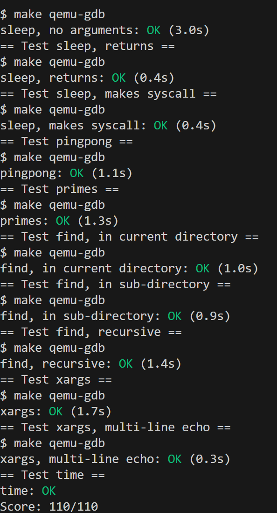
## 实验目的

- 熟悉xv6及其系统调用

---

## 1. 启动 xv6

### 实验目的

- 设置计算机以运行实验

### 实验步骤

1. 克隆到本地:
   
   在wsl2下执行：
   
   ```bash
   $ git clone git://g.csail.mit.edu/xv6-labs-2024
   Cloning into 'xv6-labs-2024'
   
   $ cd xv6-labs-2024
   ```
2. 尝试运行xv6：
   
   ```bash
   $ make qemu
   ```
   
   输出：
   
   ```bash
   ···
   xv6 kernel is booting
   
   hart 2 starting
   hart 1 starting
   init: starting sh
   ```
3. 退出qemu:
   同时按下 `Ctrl + a`，再按下 `x`.

## 2. sleep

### 实验目的

在 xv6 操作系统中实现一个用户级的 sleep 程序，接受用户指定的时间参数，使进程暂停运行相应的时长。通过此实验，尝试理解 xv6 系统调用机制、用户程序与内核的交互方式，以及命令行参数的处理方法。

### 实验步骤

1. 阅读 xv6 第一章以及user目录下文件
2. 在 xv6 的 user/ 目录下创建 sleep.c 文件。
3. 根据实验要求以及注意事项，程序需要注意：
   
   - 若参数数量不足，打印错误信息并退出
   - 使用 atoi() 函数将字符串参数转换为整数
   - sleep() 调用返回后，调用 exit(0) 正常退出
4. 在 Makefile 的 UPROGS 变量中添加 sleep 程序，使其能够被编译并加入 xv6 文件系统。
   
   ```bash
   $U/_sleep\
   ```
5. 使用 make qemu 启动 xv6，键入 `sleep`命令测试功能，并使用make grade判断测试是否通过。

### 实验中遇到的问题和解决方法

1. 命令行参数处理错误
   
   - 解决方法：参考 user/echo.c 的实现，了解argc 表示命令行参数的数量（argument count），包括程序本身的名字；argv 是一个字符串数组（argument vector），输入命令行的每个元素都是一个参数
2. `make qemu`时出现链接错误
   
   - 解决方法：在`Makefile`的`UPROGS`中添加`$U/_sleep`，确保编译系统能够识别并编译新程序

### 实验心得

1. 通过查阅 user/usys.S 和 kernel/sysproc.c，了解了用户程序通过`ecall`指令引发trap进入内核态，然后内核trap完成实际功能的流程。
2. 学会了如何正确创建用户程序、处理命令行参数、调用系统调用、如何将新程序添加到 xv6 系统中。

## 3. pingpong

### 实验目的

编写一个用户级程序使用 xv6 系统调用在两个进程之间通过管道进行一字节的"乒乓"通信。通过实践加深对进程间通信、管道机制、进程创建等操作系统概念的理解。

### 实验步骤

#### 1. 参考 xv6 的 user/ 目录下的 pipe、fork 等示例程序。

#### 2. 在 `user`目录下新建 `pingpong.c`文件。

#### 3. 代码实现

- 创建两个管道`parent[2]`和`child[2]`，分别用于父到子、子到父通信。
- 调用 fork() 创建子进程。
- 父进程和子进程各自关闭不需要的管道端口，避免阻塞和资源浪费。
- 父进程向子进程发送一个字节，等待子进程回复。
- 子进程收到字节后，打印`<pid>`: received ping，再回复父进程。
- 父进程收到回复后，打印`<pid>`: received pong。
- 两个进程均在结束前关闭所有用过的管道端口，并调用 exit(0) 正常退出。

#### 4. 修改 Makefile

在 Makefile 的 UPROGS 变量中添加：

```c
$U/_pingpong\
```

#### 5. 测试

```c
$ make qemu
$ pingpong
```

输出

```c
4: received ping
3: received pong
```

### 实验中遇到的问题和方法

#### 问题1：未正确关闭不需要的管道端，导致程序阻塞。

**解决方法**：根据父子进程各自需要的管道端，在 fork 后关闭不需要的端：

- 由于子进程子进程只需要父到子管道的读端和子到父管道的写端，关闭父到子管道的写端和子到父管道的读端
- 父进程只需要父到子管道的写端和子到父管道的读端，关闭父到子管道的读端和子到父管道的写端

### 实验心得

1. 通过实现 pingpong 程序，掌握了管道的基本用法，理解了父子进程如何通过管道进行数据交换，以及父进程先写后读、子进程先读后写的阻塞读写机制可实现进程同步。
2. 及时关闭不需要的管道端口可以防止资源泄漏和死锁。

## 4. primes

### 实验目的

本次实验需要完成一个使用管道和进程协作的并发素数筛选程序。该方案源自Unix管道发明者Doug McIlroy的设计思路，要求在xv6系统中通过创建多个协作进程，构建一个能够高效筛选素数的流水线处理系统。

### 实验步骤

1. 研究基于管道通信的素数筛算法，理解每个素数对应一个独立筛选进程的设计思想:
   
   - 首个处理进程从左侧管道读取数据，识别出第一个素数并输出
   - 随后为每个新发现的素数创建专属进程，负责过滤该素数的倍数
   - 各进程间通过管道连接，形成连续的数据处理链
2. 主函数 `main()`:
   
   - 创建初始管道，用于传递 2~280 的整数序列
   - 创建第一个子进程，负责执行筛选逻辑
   - 父进程向管道中写入待筛选的整数序列
   - 写完数据后关闭管道写端，通知下游处理
   - 等待所有子进程完成工作
3. 实现递归筛选函数 `sieve()`:
   
   - 从输入管道读取第一个数，根据素数筛选法，这必然是素数
   - 打印该素数
   - 创建新管道，用于传递过滤后的数据
   - 创建子进程递归处理下一级筛选
   - 在当前进程中，将不能被当前素数整除的数传递给新管道
   - 注意使用`__attribute__((noreturn))` 避免编译警告
4. 进程注意事项:
   
   - 每个筛选进程仅保留必要的管道端口
   - 使用`close()` 及时关闭不需要的文件描述符
   - 通过检查`read()` 返回值判断数据流结束
   - 用`wait()` 确保子进程正常结束
5. 修改 `Makefile`：
   
   ```bash
   $U/_primes\
   ```
6. 运行测试:
   
   ```bash
   $ make qemu
   $ primes
   
   // 输出2到280的素数
   ```
   
   或在qemu外输入:
   
   ```bash
   $ make GRADEFLAGS=primes grade
   
   primes: OK (2.9s)
   ```

### 遇到的问题及解决方法

1. xv6系统对进程数量和文件描述符有严格限制，若文件描述符泄漏会导致后续进程无法创建管道
   
   - 解决方法：实现中只保留必需的文件描述符：
     
     子进程创建后立即关闭父进程的管道写端：`close(pfd[1])`
     子进程递归调用前关闭不再需要的读端：`close(pfd[0])`
     因为父进程只负责向新创建管道写入数据，关闭该管道的读端，
     数据传输完成后关闭所有剩余管道
2. 需要确保所有衍生进程按正确顺序完成工作，避免子进程提前退出导致管道断裂
   
   - 解决方法：
     
     在每个 `sieve()` 函数中使用 `wait(0)` 等待直接子进程结束
     递归使每个进程负责创建和等待下一级筛选进程
3. 无论在哪个分支，函数都通过 `exit(0)` 结束进程，而不是正常返回
   
   - 解决方法：
     
     添加 `void sieve(int pfd[2]) __attribute__((noreturn))`明确告知编译器此函数不会返回到调用点，消除"控制流到达非void函数末尾"的警告

### 实验心得

素数筛选实现了流水线（pipeline）处理。每个进程接收上游数据，处理后传递给下游，多个进程可以同时工作。不仅提高了计算效率，还自然地将问题分解为可并行处理的子任务。通过这个实验，我更深入地理解了流水线并发的工作原理和优势。

`sieve`函数在进程创建递归调用，每个新得到的素数都会创建一个新的筛选进程，而不需要事先确定进程数量。这种方法展示了递归思想在编程中的妙用。

## 5. find

### 实验目的

实现一个简化版的 UNIX find 程序，用于在 xv6 操作系统中递归查找指定目录树下所有与给定文件名匹配的文件。通过本实验，掌握 xv6 文件系统的目录遍历、递归编程方法以及字符串处理技巧。

### 实验步骤

1. 参考 user/ls.c，学习如何读取目录内容。
2. 编写 find 函数:
   - 递归遍历目录树，查找与目标文件名匹配的文件。
   - 在遍历过程中，跳过 "." 和 ".." 目录，避免死循环。
   - 使用 strcmp 进行字符串比较，避免直接用 ==。

核心代码如下：

```c
void find(char *path, char *filename) {
    // 参数：fd表示打开的目录，de用于存储读取的信息，st用于获取文件类型
    char buf[512], *p;
    int fd;
    struct dirent de;
    struct stat st;

    // 错误检查
    if ((fd = open(path, 0)) < 0) {
        fprintf(2, "无法打开目录 %s\n", path);
        return;
    }

    if ((fstat(fd, &st)) < 0) {
        fprintf(2, "无法获取目录 %s 的状态\n", path);
        close(fd);
        return;
    }

    if (st.type != T_DIR) {
        fprintf(2, "%s 不是一个目录\n", path);
        close(fd);
        return;
    }

    if (strlen(path) + 1 + DIRSIZ + 1 > sizeof buf) {
        fprintf(2, "路径太长\n");
        close(fd);
        return;
    }

    strcpy(buf, path);
    p = buf + strlen(buf);
    *p++ = '/';

    // 遍历当前目录
    while (read(fd, &de, sizeof(de))) {
        // 跳过无效的目录项，只处理实际存在的文件和目录
        if (de.inum == 0) continue;

        memmove(p, de.name, DIRSIZ);
        p[DIRSIZ] = 0;

        if (stat(buf, &st) < 0) {
            fprintf(2, "无法获取文件 %s 的状态\n", buf);
            continue;
        }

        // 跳过当前目录和父目录
        if (strcmp(de.name, ".") == 0 || strcmp(de.name, "..") == 0) continue;

        // 文件名匹配
        if (strcmp(de.name, filename) == 0) {
            printf("%s\n", buf);
        }

        // 递归搜索子目录
        if (st.type == T_DIR) {
            find(buf, filename);
        }
    }

    close(fd);
}
```

3. 在 Makefile 的 UPROGS 中添加 find 程序，确保其能被编译进系统。
4. 测试 find 程序功能。

```bash
$ make GRADEFLAGS=find grade

== Test find, in current directory == find, in current directory: OK (2.6s) 
== Test find, in sub-directory == find, in sub-directory: OK (0.4s) 
== Test find, recursive == find, recursive: OK (1.1s)
```

### 实验中遇到的问题和解决方法

1. C 语言中不能用 == 比较字符串，需用 strcmp。
   
   - 解决方法：
     
     查阅后，改用 strcmp 进行文件名匹配。
2. 在递归进入子目录时，需正确拼接路径。
   
   - 解决方法:
     
     通过缓冲区和指针操作，确保路径格式正确，且不越界。
3. 多次测试后，文件系统中产生了多余文件。
   
   - 解决方法：
     通过 make clean 和 make qemu 重新初始化文件系统，保证测试环境干净。

### 实验心得

通过本次实验，深入理解了 xv6 文件系统的目录结构和遍历方法:

xv6 文件系统采用类 Unix 的层次化目录结构，根目录为 /，其下可以有多个子目录和文件。每个目录本质上是一个特殊的文件，包含若干目录项（dirent），每个目录项记录了文件名和 inode 编号。

1. 打开目录：使用 open() 打开目录，获取文件描述符。
2. 读取目录项：用 read() 逐个读取 struct dirent 结构体，获取每个文件/子目录的名字和 inode。
3. 跳过无效项：如果 dirent.inum == 0，说明该项无效，需跳过。
   跳过特殊目录：目录中总有 "."（当前目录）和 ".."（父目录），遍历时要跳过它们，避免递归死循环。
4. 拼接路径：对子目录递归时，需要将当前路径与子目录名拼接，形成新的完整路径。
5. 判断类型：用 stat() 获取路径对应的 stat 结构体，判断是普通文件还是目录。只有目录才递归。
6. 递归遍历：对子目录递归调用遍历函数，实现整个目录树的遍历。

## 6. xargs

### 实验目的

实现一个简化版的 UNIX xargs 程序，在 xv6 操作系统中实现命令参数的自动拼接与批量执行。通过本实验，掌握标准输入读取、命令行参数拼接、进程创建与管理（fork/exec/wait）等操作系统基本机制。

### 实验步骤

1. 阅读实验要求，理解 xargs 的工作原理：
   - 读取标准输入的每一行，将其作为参数追加到命令后面，然后执行该命令。
2. 代码实现：
   - 复制命令行参数到 argv 数组备用。
   - 逐行读取标准输入（以 \n 结尾），每行作为新参数追加到命令后。
   - 用 fork 创建子进程，子进程用 exec 执行拼接后的命令。
   - 父进程用 wait 等待子进程结束。
   - 注意参数数量不能超过 MAXARG。
3. 在 Makefile 的 UPROGS 变量中添加 xargs。
4. 编译并测试：
   ```bash
   $ echo hello too | xargs echo bye
   bye hello too
   ```

### 实验中遇到的问题和解决方法

1. 不知道如何正确读取标准输入并分割参数：
   - 解决方法：参考 user/echo.c 的参数处理方式，使用 read(0, &c, 1) 逐字符读取，遇到空格或换行分割参数。
2. exec 参数数组溢出：
   - 解决方法：查阅 kernel/param.h，确保参数总数不超过 MAXARG。

### 实验心得

- 管道可将前一个进程的输出作为下一进程的输入，但很多命令不接收管道的传递方式（如echo），其不能直接接收标准输入，而需要接收命令行参数。
  此时需要使用`xargs`命令将管道传输过来的stdin进行处理，然后传递到命令的参数位上。即xargs指令执行: 处理管道左侧的标准输入以及处理后传递到正确的位置上。如果不加xargs指令，则echo命令会提示缺少操作参数。
- xargs命令其实是将管道的标准输入与命令参数拼接为一个新命令行参数。其从输入中读取字符串，直到遇到 \n 或 \r 则停止， 然后将所有读取参数放在一个字符串数组里，将每一行都作为一个参数 fork 出一个子进程来执行 exec 系统调用。

---

# Lab2: System Call

## 实验结果
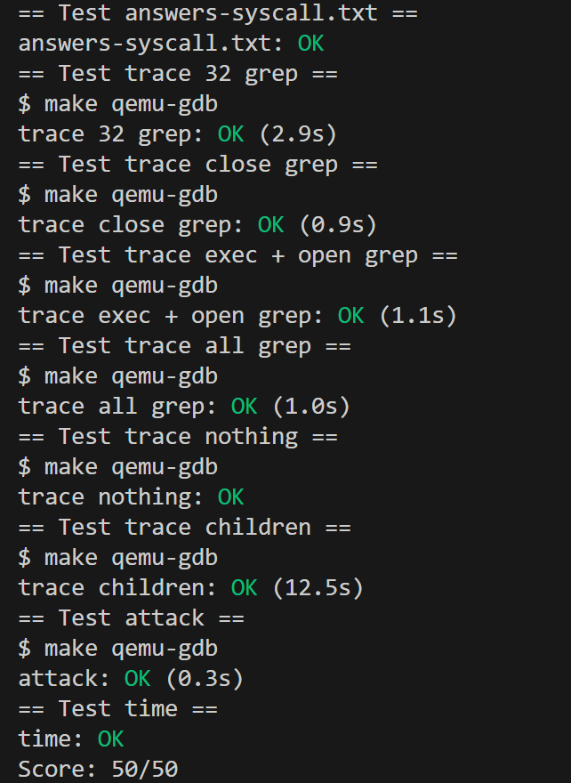

## 实验目的

向xv6添加一些新的系统调用，了解它们的工作原理，以及xv6内核的一些内部机制。

---

## 1. Using gdb

### 实验目的

在很多情况下，打印语句足以调试您的内核，但有时单步执行代码或获取堆栈回溯信息会很有用。GDB 调试器可以提供帮助。

### 实验步骤

1. 运行`make qemu-gdb`，然后新建终端中输入`gdb`
2. 输入:

```bash
(gdb) b syscall
断点 1 在 0x80002142：文件 kernel/syscall.c，第 243 行。

(gdb) c
继续。
[切换到线程 1.2]
线程 2 命中断点 1，syscall () 在 kernel/syscall.c:243
243 {
(gdb) layout src
(gdb) backtrace
```

### 实验中遇到的问题和解决方法

1. 运行 `make qemu-gdb`报错：
   
   ```bash
   .gdbinit:2: Error in sourced command file:
   Undefined item: "riscv:rv64".
   ```
   
   - 解决方法：检查系统上安装的GDB版本：
   
   ```bash
   gdb --version && which gdb-multiarch 2>/dev/null || echo "gdb-multiarch未安装"
   ```
   
   删除 `.gdbinit.tmpl-riscv`中 `set architecture riscv`这一行，然后输入 `gdb-multiarch -q`
   并输入 `target remote localhost:26000（输入删掉的端口）`连接到gdb

### 实验心得

熟悉了GDB在操作系统内核调试中的基本工作流程，包括连接远程目标、设置断点、单步执行、检查变量和内存、分析调用栈等；

## 2. system call tracing

### 实验目的

本实验旨在为XV6操作系统内核添加一个系统调用跟踪（`trace`）功能。该功能允许用户程序指定一个跟踪掩码（`mask`），来监控特定系统调用的执行情况。当被跟踪的进程执行掩码中设定的系统调用时，内核将在该系统调用返回前打印一行调试信息，包括进程ID、系统调用名称和返回值。

### 实验步骤

- 准备user调用接口
  
  1. 在`UPROGS` 字段中添加`$U/_trace`，以便编译系统提供的用户态测试程序`trace.c`。
  2. 在`user/user.h` 中声明`trace` 系统调用的用户态函数原型：
  
  ```c
  // 在系统调用列表末尾添加trace系统调用声明
  int trace(int);
  ```
  
  3. 在`user/usys.pl` 的末尾添加`entry("trace");`，生成系统调用的汇编入口点：
  
  ```perl
  # 添加trace系统调用的入口点
  entry("getpid");
  entry("sbrk");
  entry("sleep");
  entry("uptime");
  entry("trace");   # 新增的trace系统调用入口点
  ```
  
  4. 在`kernel/syscall.h` 中为`trace` 分配一个唯一的系统调用号：
  
  ```c
  // 系统调用号定义
  #define SYS_link   19
  #define SYS_mkdir  20
  #define SYS_close  21
  #define SYS_trace  22   // 为trace系统调用分配的唯一系统调用号
  ```
- 实现kernel调用
  
  1. 在`kernel/proc.h` 的`struct proc` 结构中添加一个新字段`tracemask`，用于存储跟踪掩码：
  
  ```c
  // 进程结构体
  struct proc {
    struct spinlock lock;
  
    // p->lock must be held when using these:
    enum procstate state;        // 进程状态
    void *chan;                  // 如果非零，表示进程正在休眠
    int killed;                  // 如果非零，表示进程已被杀死
    int xstate;                  // 退出状态
    int pid;                     // 进程ID
  
    // wait_lock must be held when using this:
    struct proc *parent;         // 父进程
  
    // these are private to the process, so p->lock need not be held.
    uint64 kstack;               // 内核栈的虚拟地址
    uint64 sz;                   // 进程内存大小（字节）
    pagetable_t pagetable;       // 用户页表
    struct trapframe *trapframe; // trampoline.S的数据页
    struct context context;      // 上下文，用于切换到该进程
    struct file *ofile[NOFILE];  // 打开的文件
    struct inode *cwd;           // 当前目录
    char name[16];               // 进程名（用于调试）
    int tracemask;               // 系统调用跟踪掩码，用于存储要跟踪的系统调用
  };
  ```
  
  2. 在`kernel/sysproc.c` 中实现`sys_trace()` 函数，用于设置进程的跟踪掩码：
  
  ```c
  uint64
  sys_trace(void)
  {
    int mask;
  
    // 从系统调用参数中获取跟踪掩码
    argint(0, &mask);
  
    // 设置当前进程的tracemask
    myproc()->tracemask = mask;
  
    return 0;
  }
  ```
  
  3. 在`kernel/syscall.c` 的函数原型声明部分添加`sys_trace` 函数：
  
  ```c
  // 系统调用函数原型
  extern uint64 sys_fork(void);
  extern uint64 sys_exit(void);
  ...
  extern uint64 sys_close(void);
  extern uint64 sys_trace(void);  // 新增的trace系统调用函数声明
  ```
  
  然后在系统调用表中添加 `sys_trace` 函数：
  
  ```c
  // 系统调用号到函数指针的映射表
  static uint64 (*syscalls[])(void) = {
  [SYS_fork]    sys_fork,
  ...
  [SYS_mkdir]   sys_mkdir,
  [SYS_close]   sys_close,
  [SYS_trace]   sys_trace,  // 添加sys_trace函数到系统调用表
  };
  ```
  
  4. 打印跟踪信息：
     
     - 在`kernel/syscall.c` 中创建一个系统调用名称数组：
     
     ```c
     // 系统调用名称数组，用于追踪输出
     static char *syscallnames[] = {
     [SYS_fork]    "fork",
     [SYS_exit]    "exit",
     [SYS_wait]    "wait",
     [SYS_pipe]    "pipe",
     [SYS_read]    "read",
     [SYS_kill]    "kill",
     [SYS_exec]    "exec",
     [SYS_fstat]   "fstat",
     [SYS_chdir]   "chdir",
     [SYS_dup]     "dup",
     [SYS_getpid]  "getpid",
     [SYS_sbrk]    "sbrk",
     [SYS_sleep]   "sleep",
     [SYS_uptime]  "uptime",
     [SYS_open]    "open",
     [SYS_write]   "write",
     [SYS_mknod]   "mknod",
     [SYS_unlink]  "unlink",
     [SYS_link]    "link",
     [SYS_mkdir]   "mkdir",
     [SYS_close]   "close",
     [SYS_trace]   "trace",
     };
     ```
     
     - 修改`syscall()` 函数，实现系统调用跟踪：
     
     ```c
     void
     syscall(void)
     {
       int num;
       struct proc *p = myproc();
     
       num = p->trapframe->a7;  // 获取系统调用号
       if(num > 0 && num < NELEM(syscalls) && syscalls[num]) {
         // 调用对应的系统调用函数，并保存返回值
         uint64 result = syscalls[num]();
         p->trapframe->a0 = result;
     
         // 如果进程的tracemask中对应的位被设置，则输出跟踪信息
         if(p->tracemask & (1 << num)) {
           printf("%d: syscall %s -> %d\n", p->pid, syscallnames[num], (int)result);
         }
       } else {
         printf("%d %s: unknown sys call %d\n",
                 p->pid, p->name, num);
         p->trapframe->a0 = -1;
       }
     }
     ```
- 处理进程派生（Fork）
  
  1. 在 `kernel/proc.c` 的 `fork()` 函数中添加代码，使子进程继承父进程的跟踪掩码：
     
     ```c
     int
     fork(void)
     {
     
     // 复制进程名称
     safestrcpy(np->name, p->name, sizeof(p->name));
     
     // 子进程继承父进程的tracemask
     np->tracemask = p->tracemask;
     
     pid = np->pid;
     
     // ... 省略部分代码 ...
     
     return pid;
     }
     ```
  2. 在 `kernel/proc.c` 的 `allocproc()` 函数中，确保新分配的进程默认不跟踪任何系统调用：
     
     ```c
     static struct proc*
     allocproc(void)
     {
     // ... 省略部分代码 ...
     
     memset(&p->context, 0, sizeof(p->context));
     p->context.ra = (uint64)forkret;
     p->context.sp = p->kstack + PGSIZE;
     
     // 初始化tracemask为0，默认不跟踪任何系统调用
     p->tracemask = 0;
     
     return p;
     }
     ```

### 实验中遇到的问题和解决方法

1. 问题：未定义的trace引用
   
   - 完成初步修改后，运行`make qemu` 出现编译错误，提示无法编译`user/trace.c`，因为找不到`trace` 系统调用的用户态桩代码。
   - 解决方法： 严格按照提示，系统性地添加了所有用户态接口：在`user/user.h` 添加原型，在`user/usys.pl` 添加入口，在`kernel/syscall.h` 添加系统调用号。确保接口在所有层面都已定义。
2. 问题：不清楚内核如何访问用户态参数
   
   - 在实现`sys_trace` 时，不确定如何安全地读取用户传递的整数参数`mask`。
   - 解决方法： 参考`kernel/sysproc.c` 中其他系统调用（如`sys_kill`）的实现，发现内核提供了`argint()`等函数来获取用户态传递的参数。使用`argint(0, &mask)` 成功获取了第一个参数。

### 实验心得

通过这次实验，简要了解xv6的系统调用流程：用户程序通过调用定义在user.h中的函数（如trace()）发起系统调用，这些函数实际上是通过usys.pl脚本生成的汇编代码，将系统调用号放入a7寄存器，然后执行ecall指令进入内核态。CPU执行ecall后进入内核的陷阱处理程序，最终路由到syscall()函数。然后syscall()根据a7寄存器中的系统调用号，从syscalls[]数组中找到对应的处理函数并调用。最后系统调用完成，将结果存入a0寄存器，返回用户态。

## 3. attack xv6

### 实验目的

- 如果系统调用的实现中存在漏洞，攻击者可能会利用该漏洞突破内核与用户程序之间的隔离边界。实验提供了一个xv6的bug，为了了解bug是如何被利用的,实验需要欺骗xv6，获取另一个过程的秘密。

### 实验步骤
如图：

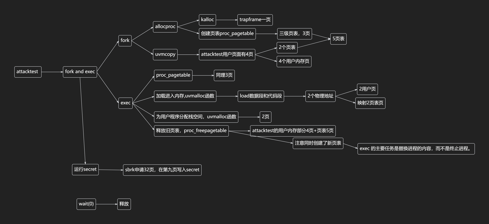

1. 首先观察attacktest的函数:
   1. ```
      if((pid = fork()) < 0) {
          printf("fork failed\n");
          exit(1);   
        }
      if(pid == 0) {
          char *newargv[] = { "secret", secret, 0 };
          exec(newargv[0], newargv);
          printf("exec %s failed\n", newargv[0]);
          exit(1);
        }
      ```
      
      其首先fork子进程，然后exec了secret程序
   2. 根据fork函数内容：
      
      1. ```
         // Allocate process.
           if((np = allocproc()) == 0){
             return -1;
           }
         
           // Copy user memory from parent to child.
           if(uvmcopy(p->pagetable, np->pagetable, p->sz) < 0){
             freeproc(np);
             release(&np->lock);
             return -1;
           }
           np->sz = p->sz;
         ```
         
         1. 首先调用allocproc，为创建子进程做准备
         2. 在allocproc中，
            
            1. 首先调用了kalloc为trapframe分配空间，占1页
            2. 然后分配一个空的页表，这个页表建立到trampoline和trapframe的映射
            3. Xv6采用riscv的sv39模式，采用三级页表，因此proc_pagetable新分配了3页
         3. 将父进程attcaktest的用户页面拷贝到secret中，由于其有4页，所以这一步创建了两个页表页，和4个用户内存页
   3. exec执行secret
      
      1. 在exec中：
         
         ```
         if((pagetable = proc_pagetable(p)) == 0)
            goto bad;

         // Load program into memory.
         for(i=0, off=elf.phoff; i<elf.phnum; i++, off+=sizeof(ph)){
            if(readi(ip, 0, (uint64)&ph, off, sizeof(ph)) != sizeof(ph))
               goto bad;
            if(ph.type != ELF_PROG_LOAD)
               continue;
            if(ph.memsz < ph.filesz)
               goto bad;
            if(ph.vaddr + ph.memsz < ph.vaddr)
               goto bad;
            if(ph.vaddr % PGSIZE != 0)
               goto bad;
            uint64 sz1;
            if((sz1 = uvmalloc(pagetable, sz, ph.vaddr + ph.memsz, flags2perm(ph.flags))) == 0)
               goto bad;
            sz = sz1;
            if(loadseg(pagetable, ph.vaddr, ip, ph.off, ph.filesz) < 0)
               goto bad;
         }
         // ···
         proc_freepagetable(oldpagetable, oldsz);
         ```
         1. 在exec中首先分配一个新的pagetable，根据对于proc_pagetable的分析，这里会新分配3页。
         2. 随后将elf中需要load的段装入内存，secret的elf有两个需要装入的段(代码段和数据段)，各占一页。
         3. 随后分配了两页，一页作为用户栈，一页作为guard
         4. exec的最后释放了旧页表，由于uvmunmap函数并没有释放trapframe的物理内存，因为此时新页表也在映射该内存，并没有分配一个新的页作为trapframe。所以这块释放的只是attacktest的用户内存部分4页+页表5页。
   
   4. secret创建运行，在其运行时调用了sbrk最终调用了growproc，使用户内存增加了32页，由于exec创建了一个用户页表，一个页表页有512页，因此不用分配新的页表页，所以这一步新分配了32页。

   5. secret exit，在attacktest的wait中调用了freeproc释放secret的内存

   6. 随后attacktest调用attack，
   
   由于attack和secret同样都只有4页用户内存，因此在执行attack的时候系统分配的页面数应该与secret时相同，即1(trapframe)+3(proc_pagetable)+6(uvmcopy)+3(proc_pagetable)+4(load)+2(stack & guard) - 9(oldpagetable) = 10页。

   由于xv6使用一个链式栈管理空闲物理内存，secret写入秘密的是分配的32页中的第10页所以其前面有22页+5(pagetable)页，attack一开始占用了10页，所以attack只要分配到第17页读取相应位置就可以得到秘密。

### 实验中遇到的问题和解决方法
1. 不了解如何获取secret写入秘密的页
   - 解决方法：

   查看`attacktest.c`中调用的各个函数的源码，分析分配内存页的过程

2. 不了解attacktest和secret的页数
   - 解决方法：

   通过命令`readelf -l user/_attacktest`得知其用户内存为4页

### 实验心得
这道题的主要思路是利用xv6是利用链式栈管理空闲物理内存的特点，以及这次实验特地加上的bug即kalloc和kfree的时候不会破坏页内的内容，使得attack只要定位并分配到secret写入秘密的页就可以将秘密读出。原理很简单，但是定位secret写入秘密的页并不容易，需要分析清楚进程销毁还有fork和exec过程分配和释放内存的细节。

这个实验也让我思考了权限隔离的重要性，以及如何在系统设计中防止类似的信息泄露漏洞。

---

# Lab3: page tables
## 实验结果：
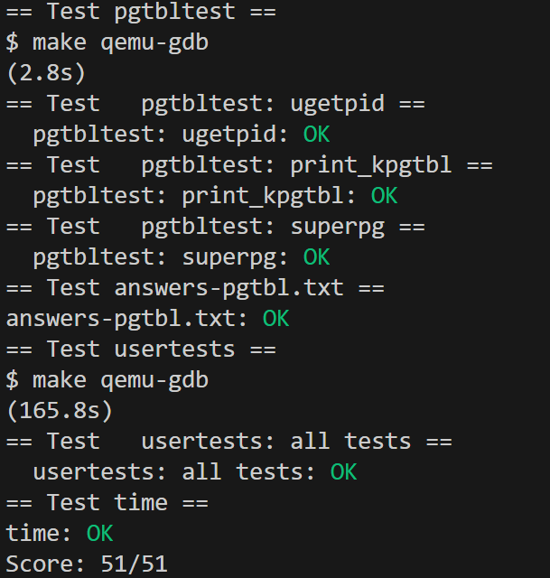
---

## 1. Inspect a user-process page table
### 实验目的
为了帮助理解RISC-V的页表结构，解释用户进程的页表。
### 实验步骤
1. 输入
```
$ make qemu
$ pgtbltest

print_pgtbl starting
va 0x0 pte 0x21FC885B pa 0x87F22000 perm 0x5B
va 0x1000 pte 0x21FC7C1B pa 0x87F1F000 perm 0x1B
va 0x2000 pte 0x21FC7817 pa 0x87F1E000 perm 0x17
va 0x3000 pte 0x21FC7407 pa 0x87F1D000 perm 0x7
va 0x4000 pte 0x21FC70D7 pa 0x87F1C000 perm 0xD7
va 0x5000 pte 0x0 pa 0x0 perm 0x0
va 0x6000 pte 0x0 pa 0x0 perm 0x0
va 0x7000 pte 0x0 pa 0x0 perm 0x0
va 0x8000 pte 0x0 pa 0x0 perm 0x0
va 0x9000 pte 0x0 pa 0x0 perm 0x0
va 0xFFFF6000 pte 0x0 pa 0x0 perm 0x0
va 0xFFFF7000 pte 0x0 pa 0x0 perm 0x0
va 0xFFFF8000 pte 0x0 pa 0x0 perm 0x0
va 0xFFFF9000 pte 0x0 pa 0x0 perm 0x0
va 0xFFFFA000 pte 0x0 pa 0x0 perm 0x0
va 0xFFFFB000 pte 0x0 pa 0x0 perm 0x0
va 0xFFFFC000 pte 0x0 pa 0x0 perm 0x0
va 0xFFFFD000 pte 0x0 pa 0x0 perm 0x0
va 0xFFFFE000 pte 0x21FD08C7 pa 0x87F42000 perm 0xC7
va 0xFFFFF000 pte 0x2000184B pa 0x80006000 perm 0x4B
print_pgtbl: OK
```

2. print_pgtbl()函数：
```
void
print_pgtbl()
{
  printf("print_pgtbl starting\n");
  for (uint64 i = 0; i < 10; i++) {
    print_pte(i * PGSIZE);
  }
  uint64 top = MAXVA/PGSIZE;
  for (uint64 i = top-10; i < top; i++) {
    print_pte(i * PGSIZE);
  }
  printf("print_pgtbl: OK\n");
}
```
分别打印了前十页页表条目和后十页页表条目.

   1. print_pte函数：
   ```
   void
   print_pte(uint64 va)
   {	//通过系统调用，获取条目
      pte_t pte = (pte_t) pgpte((void *) va);
      printf("va 0x%lx pte 0x%lx pa 0x%lx perm 0x%lx\n", va, pte, PTE2PA(pte), PTE_FLAGS(pte));
   }
   ```

3. 解释：
例如`va 0x0 pte 0x21FC885B pa 0x87F22000 perm 0x5B`

   1. 虚拟地址 (va 0x0)
   2. 页表项 (pte 0x21FC885B，即`0010 0001 1111 1100 1000 1000 0101 1011`)：
      1. 物理页框地址（Physical Page Frame Address）：pte[63:10]

      2. 权限位和控制位：pte[9:0]
         有效位（PTE_V）：1，表示该页表项有效。

         读权限（PTE_R）：1，表示该页是可读的。

         用户访问权限（PTE_X）：1，表示可以执行。

         执行权限（PTE_U）：1，表示该用户态可以访问。

   3. 映射到的物理地址 (pa 0x87F22000)
   4. 权限位 (perm 0x5B，该页的访问权限)
      有效位（PTE_V）：1，表示该页表项有效。

      读权限（PTE_R）：1，表示该页是可读的。

      写权限（PTE_W）：0，不可写。

      用户访问权限（PTE_X）：1，表示可以执行。

      执行权限（PTE_U）：1，表示该用户态可以访问。

### 实验中遇到的问题和解决方法

1. 理解 RISC-V 页表项结构：
   - 解决方法：详细阅读 xv6 书籍第 3 章和 `kernel/riscv.h` 文件，了解页表项的各个位的含义和 RISC-V SV39 虚拟内存系统的设计。

### 实验心得

通过本实验，我深入理解了 RISC-V 的页表结构和 xv6 的内存管理机制：

1. RISC-V SV39 虚拟内存系统使用三级页表，每个页表项占 64 位，但实际只使用 54 位（44 位物理页号 + 10 位标志位）。

2. 页表项中，最低位（第 0 位）是有效位（PTE_V），它决定了这个页表项是否有效。如果该位为 0，则其他位都将被忽略。

## 2. Speed up system calls
### 实验目的
某些操作系统（例如 Linux）通过在用户空间和内核之间共享只读区域的数据，来加快某些系统调用的速度。这样在执行这些系统调用时就无需进行内核跨越操作。为了了解如何在页表中插入映射，需要为 xv6 中的 getpid() 系统调用实现这一优化。

### 实验步骤

1. 在 `memlayout.h` 中可以看到 `USYSCALL` 的定义位置和 `struct usyscall` 的结构：

   ```c
   // User memory layout:
   // ...
   // USYSCALL (shared with kernel)
   // TRAPFRAME (p->trapframe, used by the trampoline)
   // TRAMPOLINE (the same page as in the kernel)
   #define TRAPFRAME (TRAMPOLINE - PGSIZE)
   #define USYSCALL (TRAPFRAME - PGSIZE)
   
   struct usyscall {
     int pid;  // Process ID
   };
   ```

   - 在 `proc.h` 中进程结构体已添加了对应的字段：
   
   ```c
   struct proc {
     // ...
     struct usyscall *usyscall; // fast system call
   };
   ```

2. 在 `proc.c` 的 `allocproc()` 函数中，为每个新创建的进程分配 usyscall 页面：

   ```c
   // 分配用户系统调用结构
   if ((p -> usyscall = (struct usyscall *)kalloc()) == 0) {
     freeproc(p);
     release(&p->lock);
     return 0;
   }
   p->usyscall->pid = p->pid;
   ```

3. 在 `proc.c` 的 `proc_pagetable()` 函数中，将 usyscall 页面映射到用户空间：

   ```c
   // map usyscall page below trapframe - for fast userpace system calls
   if(mappages(pagetable, USYSCALL, PGSIZE,
             (uint64)(p->usyscall), PTE_R | PTE_U) < 0){
     uvmunmap(pagetable, TRAMPOLINE, 1, 0);
     uvmunmap(pagetable, TRAPFRAME, 1, 0);
     uvmfree(pagetable, 0);
     return 0;
   }
   ```

   - 这里设置的权限是 `PTE_R | PTE_U`，表示用户空间可读但不可写

4. 在 `proc.c` 的 `freeproc()` 函数中，释放 usyscall 页面的物理内存：

   ```c
   if(p->usyscall)
     kfree((void*)p->usyscall);
   p->usyscall = 0;
   ```

   - 在 `proc.c` 的 `proc_freepagetable()` 函数中，解除 usyscall 页面的映射：

   ```c
   #ifdef LAB_PGTBL
     uvmunmap(pagetable, USYSCALL, 1, 0);
   #endif
   ```

5. 在 `ulib.c` 中，实现了 `ugetpid()` 函数，直接从映射的 usyscall 页面读取 pid：

   ```c
   int
   ugetpid(void)
   {
     struct usyscall *u = (struct usyscall *)USYSCALL;
     return u->pid;
   }
   ```

6. 测试：
   - 使用 `make qemu` 编译并运行 xv6
   - 运行 `pgtbltest` 测试程序
   - 输出为 `ugetpid_test: OK`

### 实验中遇到的问题和解决方法

1. 问题：不确定应该设置什么权限位
   - 解决方法：查阅 `kernel/riscv.h` 中的权限定义，选择 `PTE_R | PTE_U`（只读且用户可访问）

2. 问题：编译器报错
```
未定义标识符 "USYSCALL"
不允许使用指向不完整类型 "struct usyscall" 的指针或引用
```

- 原因：

在用户空间代码中使用了内核定义的符号和结构体，而这些符号和结构体在正常情况下对用户程序是不可见的。

- 解决方法：

根据测试，这个报错不影响编译。因为Makefile告诉编译器定义这些宏,因此在实际编译过程中，条件编译的代码被正确包含。

### 实验心得

通过这个实验，我理解了系统调用优化的一种重要方法：通过在用户空间和内核之间共享只读内存，避免频繁的内核态切换。传统的系统调用需要通过陷阱（trap）进入内核态，而优化后的 `ugetpid()` 只需读取映射到用户空间的内存，这大大减少了开销。实验结果表明，该方法能够大幅提升特定系统调用的执行效率，也为今后系统调用的设计与优化提供了有价值的实践依据。同时，实验中的报错也让我深刻感受到实践的重要。

## 3. Print a page table
### 实验目的

本实验的主要目标是实现一个能够可视化 RISC-V 页表内容的函数，通过打印页表的具体信息来加深对 RISC-V 内存管理机制的理解，并为后续的内核调试工作提供便利。具体任务包括编写 `vmprint()` 函数，以特定格式递归输出页表的各级条目，包括虚拟地址、PTE 内容及其对应的物理地址。

### 实验步骤

1. 根据之前的实验，了解 RISC-V 采用三级页表结构（Sv39），通过虚拟地址的高位索引顶级页表（Level 2），中间级页表（Level 1）和底层页表（Level 0）。每个页表条目（PTE）包含物理地址帧号和标志位。

2. 输出格式要求： 
```
page table 0x0000000087f22000
 ..0x0000000000000000: pte 0x0000000021fc7801 pa 0x0000000087f1e000
 .. ..0x0000000000000000: pte 0x0000000021fc7401 pa 0x0000000087f1d000
 .. .. ..0x0000000000000000: pte 0x0000000021fc7c5b pa 0x0000000087f1f000
 .. .. ..0x0000000000001000: pte 0x0000000021fc70d7 pa 0x0000000087f1c000
 .. .. ..0x0000000000002000: pte 0x0000000021fc6c07 pa 0x0000000087f1b000
 .. .. ..0x0000000000003000: pte 0x0000000021fc68d7 pa 0x0000000087f1a000
 ..0xffffffffc0000000: pte 0x0000000021fc8401 pa 0x0000000087f21000
 .. ..0xffffffffffe00000: pte 0x0000000021fc8001 pa 0x0000000087f20000
 .. .. ..0xffffffffffffd000: pte 0x0000000021fd4c13 pa 0x0000000087f53000
 .. .. ..0xffffffffffffe000: pte 0x0000000021fd00c7 pa 0x0000000087f40000
 .. .. ..0xfffffffffffff000: pte 0x000000002000184b pa 0x0000000080006000
``` 
   - 第一行输出页表基地址。  
   - 每行输出一个有效的 PTE，缩进深度反映其所在层级（顶级无缩进，每加深一级增加一个“ ..”）。  
   - 每行包含虚拟地址、PTE 的十六进制值和对应的物理地址。
   - 简而言之，就是将每一级的页表，给他按照树的形式打印出来

3. 实现 `vmprint()` 函数：  
   - 使用递归方式遍历页表树，逐级处理有效的 PTE。怎么实现递归呢？根据提示参考`freewalk`函数：
   ```
   void
   freewalk(pagetable_t pagetable)
   {
   // 页表有 2^9 = 512 个页表项（PTE）
   for(int i = 0; i < 512; i++){
      pte_t pte = pagetable[i];
      // 如果该页表项有效 (PTE_V) 且不是叶子节点（没有 R/W/X 权限）
      if((pte & PTE_V) && (pte & (PTE_R | PTE_W | PTE_X)) == 0){
         // 当前页表项指向的是下一级页表
         uint64 child = PTE2PA(pte);             // 获取子页表的物理地址
         freewalk((pagetable_t)child);           // 递归释放子页表
         pagetable[i] = 0;                        // 清空当前页表项
      } 
      // 如果是有效的叶子节点（即具有 R/W/X 权限）
      else if(pte & PTE_V){
         // 不允许释放包含实际映射的叶子节点
         panic("freewalk: leaf");
      }
   }
   // 释放当前这一页页表
   kfree((void*)pagetable);
   }
   ```
   有以下思路：
   - 若PTE_V = 1(页表项有效)，打印信息。
   - 如果PTE不是叶子节点（即不包含PTE_R, PTE_W, PTE_X任何权限位），则是一个指向下一级页表的指针，我们需要递归遍历下一级页表。

   据此实现递归函数`vmprint_re`：
   ```
   void 
   vmprint_re(pagetable_t pagetable, int level, uint64 va) {
   uint64 sz;
   // 为什么va使用uint64？因为要打印前缀，而前缀可能超过32位
   // 错误处理
   if(pagetable == 0) {
      printf("vmprint_re: null pagetable\n");
      return;
   }
   if(level < 0) {
      return;
   }

   // 根据level计算当前页表的映射范围
   if(level == 2) {
      sz = 512 * 512 * PGSIZE; // 1GB
   } else if(level == 1) {
      sz = 512 * PGSIZE; // 2MB
   } else {
      sz = PGSIZE; // 4KB
   }

   // 遍历当前页表的512个PTE
   for(int i = 0; i < 512; i++) {
      pte_t pte = pagetable[i];
      if ((pte & PTE_V) == 0) {
         continue; // 无效PTE，跳过
      }
      // 打印前缀
      for (int j = 0; j < (3 - level); j++) {
         printf(" ..");
      }
      uint64 curr_va = va + i * sz; // 计算当前PTE对应的虚拟地址
      // 为什么当前PTE对应的虚拟地址是va + i * sz？
      // 因为va是当前页表的起始虚拟地址，i是PTE索引，sz是当前页表的映射范围
      // 打印当前页表项信息
      printf("0x%lx: pte 0x%lx pa 0x%lx\n", 
         curr_va, pte, PTE2PA(pte));
      // 递归处理下一级页表
      // 不是叶子节点才递归
      if ((pte & (PTE_R | PTE_W | PTE_X)) == 0) {
         vmprint_re((pagetable_t)PTE2PA(pte), level - 1, curr_va);
      }
   }
   }
   ```

   在`vmprint`中调用该函数：
   ```
   void
   vmprint(pagetable_t pagetable) {
   printf("page table %p\n", pagetable);
   vmprint_re(pagetable, 2, 0); 
   }
   ```

4. 测试验证：  
   - 输入`make qemu`后输入`pgtbltest`系统调用触发 `vmprint()`，输出结果:
   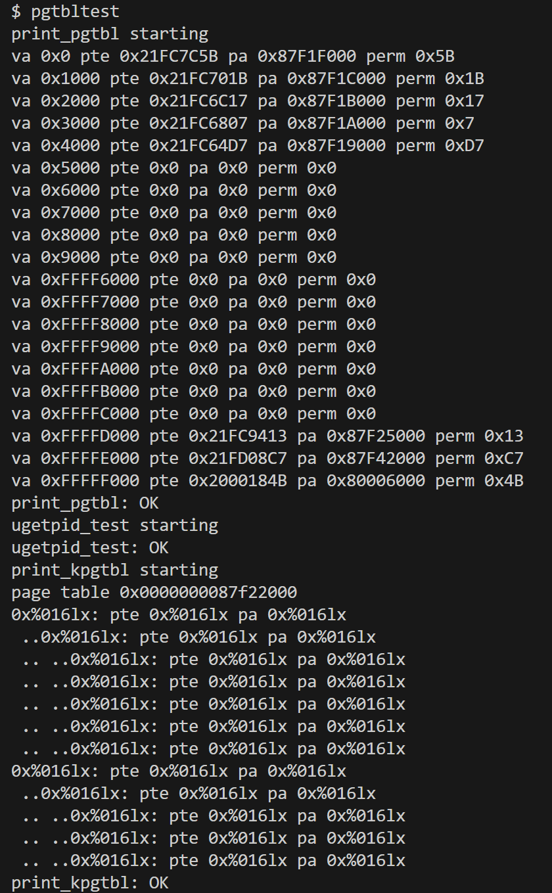

---

### 实验中遇到的问题和方法

1. va和sz（起始地址和范围）的数据类型
   - 由于RISC-V Sv39使用39位虚拟地址，前缀可能超过32位
   - 使用uint64代替int

2. 计算当前PTE对应的虚拟地址
   - va + i * sz，其中va是当前页表的起始虚拟地址，i是PTE索引，其在循环中递增，sz是当前页表的映射范围

3. 打印当前页表项信息
   - 使用%p输出非指针类型值PTE2PA(pte)
   - 查阅发现其为长无符号整数的十六进制，改为%lx
---

### 实验心得

通过实现页表遍历，进一步掌握了多级页表的组织方式、虚拟地址到物理地址的转换过程，以及 PTE 标志位的具体作用。页表的树形结构非常适合递归处理，但需注意终止条件和状态传递（如当前深度和虚拟地址的累积计算）。其中内核中提供的宏（如 `PTE2PA`、`PX`）极大简化了地址计算和标志判断，避免了手动位操作的错误。

---

## 4. Use superpages

### 实验目的
探究RISC-V架构中超级页（2MB大页）的性能优势及其实现机制。通过配置一级页表项（PTE），建立超级页映射，对比其与普通4KB页在页表内存占用和TLB缓存缺失率方面的差异，以验证大页技术对提升程序运行效率的有效性。

### 实验步骤
1. 分析`superpg_test`的代码:
```
void
superpg_test()
{
  int pid;
  
  printf("superpg_test starting\n");
  testname = "superpg_test";
  
  char *end = sbrk(N);
  if (end == 0 || end == (char*)0xffffffffffffffff)
    err("sbrk failed");
  
  uint64 s = SUPERPGROUNDUP((uint64) end);
  supercheck(s);
  if((pid = fork()) < 0) {
    err("fork");
  } else if(pid == 0) {
    supercheck(s);
    exit(0);
  } else {
    int status;
    wait(&status);
    if (status != 0) {
      exit(0);
    }
  }
  printf("superpg_test: OK\n");  
}
```

- 先通过sbrk再给进程分配Nbyte的空间（大于一个超级页），然后从SUPERPGROUNDUP(end)的地方supercheck进行测试，检查是不是分配到了超级页，如果不是超级页，则页面会发生变化，pte发生改变。

2. 分配超级页：
   - 在 xv6 操作系统中，超级页是大小为 2MB 的内存页，RISC-V Sv39 使用三级页表结构：
   第2级页表：控制 1GB 的映射范围
第1级页表：控制 2MB 的映射范围
第0级页表：控制 4KB 的映射范围
超级页大小刚好与第一级页表映射范围相同，因此使用第1级页表直接映射到物理内存的方式来分配超级页。

   代码实现：
   ```
   // 空闲超级页链
   struct {
   struct spinlock lock;
   struct run *freelist;
   } superKmem;

   //···初始化超级页锁···

   void
   freerange(void *pa_start, void *pa_end)
   {
   char *p;
   // 留出页面分配超级页
   p = (char*)PGROUNDUP((uint64)pa_start);
   for(; p + PGSIZE <= (char*)pa_end - 16 * SUPERPGSIZE; p += PGSIZE)
      kfree(p);

      p = (char*)SUPERPGROUNDUP((uint64)p);
   for(; p + SUPERPGSIZE <= (char*)pa_end; p += SUPERPGSIZE)
      superKfree(p);
   }

   void
   superKfree(void *pa)
   {
   struct run *r;

   // 如果地址不对齐，或者地址不在允许范围内，就panic
   if(((uint64)pa % SUPERPGSIZE) != 0 || (char*)pa < end || (uint64)pa >= PHYSTOP) {
      panic("superKfree");
   }

   // 用垃圾填充内存，以便捕捉悬空引用
   memset(pa, 1, SUPERPGSIZE);

   r = (struct run*)pa;

   acquire(&superKmem.lock);
   r->next = superKmem.freelist;
   superKmem.freelist = r;
   release(&superKmem.lock);
   }

   // 分配一个超级页（2MB）
   void *
   superKalloc(void)
   {
   struct run *r;

   acquire(&superKmem.lock);
   r = superKmem.freelist;
   if(r)
      superKmem.freelist = r->next;
   release(&superKmem.lock);

   if(r)
      memset((char*)r, 5, SUPERPGSIZE); // fill with junk
   return (void*)r;
   }
   ```

3. 更改uvmalloc函数：

   sbrk的工作流程：
   1. 用户态的`sbrk`函数通过系统调用进入内核。
   2. 内核中的`sys_sbrk`函数调用`growproc`来调整进程的地址空间大小。
   3. `growproc`调用`uvmalloc`来分配或释放内存。
   4. `uvmalloc`分配物理页并更新页表，完成地址空间的扩展。

- `uvmalloc`原先遍历从 oldsz 到 newsz 的地址范围，每次分配一个物理页（4KB），
然后调用 kalloc 分配物理内存。

- 要分配超级页，需要检查要是一次请求分配的虚拟地址空间足够大而且是能够作为超级页的虚拟地址始址时，分配一个超级页。代码如下：
```
for(a = oldsz; a < newsz; a += sz){
    // 检查能否分配超级页
    if (a % SUPERPGSIZE == 0 && a + SUPERPAGE <= newsz) {
      sz = SUPERPGSIZE;
      mem = superKalloc();
      printf("superKalloc 0x%x\n", mem);
    } else {
      sz = PGSIZE;
      mem = kalloc();
    }
...
if (sz == PGSIZE) {
      if(mappages(pagetable, a, sz, (uint64)mem, PTE_R|PTE_U|xperm) != 0){
        kfree(mem);
        uvmdealloc(pagetable, a, oldsz);
        return 0;
      }
  } else if (sz == SUPERPGSIZE) {
      if (mapSuperPages(pagetable, a, sz, (uint64)mem, PTE_R|PTE_U|xperm) != 0) {
        superKfree(mem);
        uvmdealloc(pagetable, a, oldsz);
        return 0;
      }
  }
```
- 当能分配超级页的时候就调用mapSuperPage将分配的超级页记录到页表上:
```
int
mapSuperPages(pagetable_t pagetable, uint64 va, uint64 size, uint64 pa, int perm)
{
  uint64 a, last;
  pte_t *pte;

  if((va % SUPERPGSIZE) != 0)
    panic("mapSuperPages: va not aligned");

  if((size % SUPERPGSIZE) != 0)
    panic("mapSuperPages: size not aligned");

  if(size == 0)
    panic("mapSuperPages: size");
  
  a = va;
  last = va + size - SUPERPGSIZE;
  for(;;){
    if((pte = walkSuper(pagetable, a, 1)) == 0)
      return -1;
    if(*pte & PTE_V)
      panic("mapSuperPages: remap");
    *pte = PA2PTE(pa) | perm | PTE_V | PTE_PS;
    if(a == last)
      break;
    a += SUPERPGSIZE;
    pa += SUPERPGSIZE;
  }
  return 0;
}
```
- 其中超级页（2MB）映射时，只需要遍历到第1级页表（大小为2MB），需要专门的 walkSuper，让你能在第1级页表直接返回对应的 PTE 指针，用于超级页映射：
```
pte_t *
walkSuper(pagetable_t pagetable, uint64 va, int alloc)
{
  if(va >= MAXVA)
    panic("walk");

  pte_t *pte = &pagetable[PX(2, va)];
  // 如果二级页表存在，进入二级页表
  if (*pte & PTE_V) {
    pagetable = (pagetable_t)PTE2PA(*pte);
  } else {
    // 不存在则分配
    if (!alloc || (pagetable = (pde_t *)kalloc()) == 0)
      return 0;
    memset(pagetable, 0, PGSIZE);
    *pte = PA2PTE(pagetable) | PTE_V;
  }
  // 返回第1级页表对应的PTE指针
  return &pagetable[PX(1, va)];
}
```

- 如果`walk`在遍历页表时发现当前页表项是超级页（PTE_PS 标志位为1），说明已经找到对应的物理页映射，无需继续遍历第0级页表:
```
if(*pte & PTE_V) {
      pagetable = (pagetable_t)PTE2PA(*pte);
      // 如果遇到超级页页表项，直接返回
      if (*pte & PTE_PS) {
        return pte;
      }
}
```

4. 更改释放页表函数`uvmunmap`:
```
for(a = va; a < va + npages*PGSIZE; a += sz){
    // 如果是超级页
    if (*pte & PTE_PS) {
      sz = SUPERPGSIZE;
    }
    sz = PGSIZE;
    if((pte = walk(pagetable, a, 0)) == 0)
      panic("uvmunmap: walk");
    if((*pte & PTE_V) == 0) {
      printf("va=%ld pte=%ld\n", a, *pte);
      panic("uvmunmap: not mapped");
    }
    if(PTE_FLAGS(*pte) == PTE_V)
      panic("uvmunmap: not a leaf");
    if(do_free){
      // 如果是普通页
      if ((*pte & PTE_PS) == 0) {
        uint64 pa = PTE2PA(*pte);
        kfree((void*)pa);
      } else { // 如果是超级页
        uint64 pa = PTE2PA(*pte);
        superKfree((void*)pa);
        sz = SUPERPGSIZE;
      }
      ...
    }
    ...
}
```

5. 由于fork会调用`uvmcopy`函数来拷贝原来的进程的数据到新的内存空间，创建一个新的页表来做虚拟地址到物理地址的映射，需要将原超级页也拷贝：
```
flags = PTE_FLAGS(*pte);
    // 如果为普通页
    if ((*pte & PTE_PS) == 0) {
      if((mem = kalloc()) == 0)
      goto err;
      memmove(mem, (char*)pa, PGSIZE);
      if(mappages(new, i, PGSIZE, (uint64)mem, flags) != 0){
      kfree(mem);
      goto err;
      }
    } else { // 如果为超级页
      szinc = SUPERPGSIZE;
      if((mem = superKalloc()) == 0)
      goto err;
      memmove(mem, (char*)pa, SUPERPGSIZE);
      if(mapSuperPages(new, i, SUPERPGSIZE, (uint64)mem, flags) != 0){
      superKfree(mem);
      goto err;
    }
  }
```

6. 运行`make qemu`以及`pgtbltest`测试，测试结果如图：
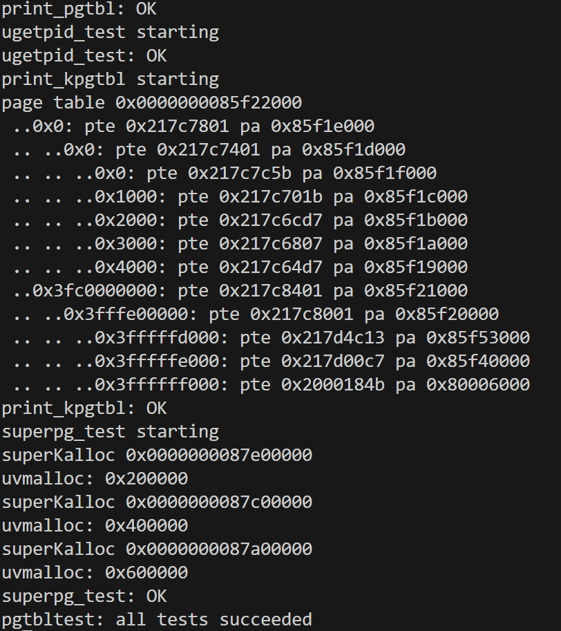


---

### 实验中遇到的问题和解决方法
1. 超级页的分配？
- 在 xv6 中，RISC-V Sv39 使用三级页表结构：
第2级（最高级）页表：控制 1GB 的映射范围
第1级页表：控制 2MB 的映射范围
第0级页表：控制 4KB 的映射范围
超级页正是利用了这种页表结构中的第1级页表直接映射功能。

2. fork之后测试失败
- 原因：fork创建的子进程的时候会拷贝原来的进程的数据到新的内存空间，然后创建一个新的页表来做虚拟地址到物理地址的映射
- 更改`uvmcopy`函数，将原来的超级页数据也拷贝到超级页。

### 实验心得
通过本次实验，我深入理解了操作系统中页表管理、系统调用优化以及进程间内存管理的核心机制。超级页通过减少页表项数量和 TLB 缺失率，显著提升了内存管理效率。在实现超级页分配时，理解了如何利用第1级页表直接映射大块内存，避免了不必要的第0级页表分配。

---
# Lab4: traps
## 实验结果
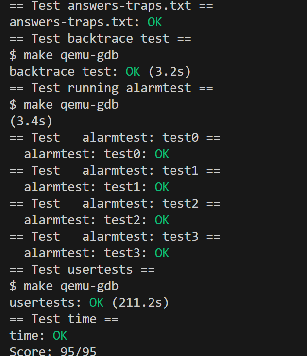
---

## 1. RISC-V assembly
### 实验目的
理解一些RISC-V汇编语言
### 实验步骤
阅读`call.asm`中的`g`，`f` ，和`main`函数
### 实验中遇到的问题与解决方法
1. 哪些寄存器包含函数的参数？例如，哪个寄存器在main对 printf 的调用中保存13？
通用寄存器a0-a7；根据代码：
```
void main(void) {
  1c:	1141                	addi	sp,sp,-16
  1e:	e406                	sd	ra,8(sp)
  20:	e022                	sd	s0,0(sp)
  22:	0800                	addi	s0,sp,16
  printf("%d %d\n", f(8)+1, 13);
  24:	4635                	li	a2,13
  ...
}
可知a2存放13
```

2. 在main的汇编代码中，对函数 f 的调用在哪里？ g 的调用在哪里？
`main`里没有对`f`或`g`的函数调用。在`main`的汇编里，直接用`li a1,12`把结果算好，说明编译器已经把`f`和`g`的调用都“内联”了（直接展开成加法运算），没有函数跳转。

3. 函数`printf`位于哪个地址？
```
// main中
26:	45b1                	li	a1,12
  28:	00001517          	auipc	a0,0x1
  2c:	84850513          	addi	a0,a0,-1976 # 870 <malloc+0x100>
  30:	68c000ef          	jal	6bc <printf>
  exit(0);
  34:	4501                	li	a0,0
  36:	26e000ef          	jal	2a4 <exit>
```
可知`printf`位于`0x6bc`（此值在不同环境下不同）

4. 在 main 中的 jalr 到 printf 之后，寄存器 ra 中的值是什么？
在 RISC-V 架构下，jalr（或 jal）指令会把“下一条指令的地址”（即当前 PC + 4）存入 ra 寄存器，作为返回地址。

在 main 调用 printf 时，使用的是 jal 指令（不是 jalr），如下：
```
30:	68c000ef          	jal	6bc <printf>
```

执行这条指令时当前 PC 是 0x30，则下一条指令地址是 0x34
所以，ra 寄存器的值就是 0x34

5. 运行以下代码：
```
 无符号整数 i = 0x00646c72;； 
 printf("H%x Wo%s", 57616, (char *) &i);； 
```

输出是什么？ 
输出结果取决于RISC-V是采用小端序这一事实。如果RISC-V改为采用大端序，为了得到相同的输出结果，你应该将i设置为多少？你需要将57616更改为其他值吗？

- 57616 用十六进制输出：e110
i 的内存内容是 0x72 0x6c 0x64 0x00（小端序，低地址在前）
- (char *)&i 作为字符串，会从低地址开始读，直到遇到 \0（0x00）为止。所以字符串内容是：0x72 = 'r', 0x6c = 'l', 0x64 = 'd'，然后遇到 0x00 结束。
即He110 World

- 大端序下，i 的内存布局是 0x00 0x64 0x6c 0x72（高地址在前）
- (char *)&i 读到第一个字节就是 0x00，字符串立刻结束，输出空字符串。要让大端序下输出 "rld"，需要让内存布局变成 0x72 0x6c 0x64 0x00，即：
i = 0x726c6400;
- 由于大端/小端只改变内存布局，而57616 的输出是e110，与字节序无关，直接传给 printf，不会受内存布局影响，因此不需要改变。

6. 在以下代码中，'y='之后会打印出什么？（注意：答案不是一个具体的值。）为什么会这样？ 
printf("x=%d y=%d", 3);
- 'y=' 之后会打印出一个未定义的值（可能是随机数、垃圾值、甚至 0），因为 printf 期望有两个参数（分别对应两个 %d），但只传了一个参数（3）。第二个 %d 会从栈上错误地取一个值。

### 实验心得
本次实验通过分析 xv6 的汇编和 C 代码，深入理解了 RISC-V 架构下的函数调用、参数传递、字节序等底层实现细节。通过实际观察编译器的优化（如函数内联）、指令执行流程的参数匹配问题，进一步体会了操作系统和硬件协作的机制。实验过程中，遇到的问题如参数不足导致的未定义行为、字节序对数据解释的影响等，都加深了对系统编程和底层原理的认识。

---
## 2. Backtrace
### 实验目的
学习并掌握 backtrace 的基本原理，理解函数调用时栈帧（stack frame）是如何构建的，以及帧指针（frame pointer）和返回地址（return address）在栈中的布局。在kernel/printf.c 中实现一个函数 backtrace()， 并在 sys_sleep 中调用它。backtrace()会打印当前栈上所有函数调用返回地址

### 实验步骤
1. 添加 r_fp() 函数读取帧指针

在 `kernel/riscv.h` 中添加如下代码（放在 `#ifndef __ASSEMBLER__ ... #endif` 之间）：

```c
static inline uint64
r_fp()
{
  uint64 x;
  asm volatile("mv %0, s0" : "=r" (x));
  return x;
}
```

2. 实现`backtrace()`函数

在 `kernel/printf.c` 中添加如下函数：

```c
void
backtrace(void)
{
  printf("backtrace:\n");

  uint64 fp = r_fp();
  uint64 base = PGROUNDDOWN(fp);

  while (fp < base + PGSIZE) {
    uint64 ra = *(uint64*)(fp - 8);
    printf("%p\n", ra);
    fp = *(uint64*)(fp - 16);
  }
}
```

3. 在 kernel/defs.h 中声明 backtrace()

在 `kernel/defs.h` 中添加一行：

```c
void backtrace(void);
```

4. 在`sys_sleep`中调用`backtrace()`

在 `kernel/sysproc.c` 中找到 `sys_sleep` 函数，加入一行调用：

```c
uint64
sys_sleep(void)
{
  int n;
  uint ticks0;

  backtrace();  // 添加这一行

  if(argint(0, &n) < 0)
    return -1;
  ...
}
```

5. 编译并运行 bttest 测试

```bash
make qemu
```

在 xv6 shell 中运行：

```bash
bttest
```

输出：

```
backtrace:
0x0000000080001d9a
0x0000000080001cbc
0x0000000080001a3e
```

6. 使用 addr2line 解析地址

退出 qemu 后，在终端运行：

```bash
addr2line -e kernel/kernel
```

然后粘贴你刚才看到的地址，比如：

```
0000000080001d9a（或0x0000000080001d9a）
0000000080001cbc
0000000080001a3e
```

按 `Ctrl-D` 结束输入，会看到类似：

```
kernel/sysproc.c:74
kernel/syscall.c:224
kernel/trap.c:85
```

---

7. 在 panic() 中调用 backtrace

在 `kernel/printf.c` 的 `panic()` 函数中，加上一行：

```c
backtrace();
```

这样在系统 panic 时也会自动打印调用栈，便于调试。

### 实验中遇到的问题和解决方法
1. printf("%p\n", *(uint64 *)(fp-8)) 打印出来是 0x0 或明显越界。
- 原因:

   把“指向返回地址的指针”和“返回地址本身”搞混了。提示里说的 “s0 指向 saved-ra 地址 + 8” 是指：
saved-ra 地址 = fp - 8
saved-fp 地址 = fp - 16

所以取 ra 时必须先做一次解引用再打印，而不是直接打印p-8这个指针值

### 实验心得
本次实验让我深入理解了内核栈帧结构和函数调用链的实现原理。通过实现`backtrace`并结合 `addr2line`工具定位源码位置，我体会到调试内核时如何利用栈回溯快速定位问题。实验过程中，遇到了格式化输出与地址解析的兼容性问题，也加深了对 xv6 内核`printf`实现的认识。

---

## 3. Alarm
### 实验目的
在 xv6 操作系统中添加一个定时报警机制（alarm），使得用户进程可以设置一个定时器，每隔固定的时间（以 CPU ticks 为单位）执行一次用户自定义的处理函数（handler）。需要实现系统调用*sigalarm(int n, (void )handler) 和 sigreturn()。当它被调用后，系统将在 n 个时钟中断后执行handler,执行完毕后调用 sigreturn 返回。

### 实验步骤
1. 首先阅读hint，因为这个实验不读hint不会做。
1. 把测试程序编进系统
Makefile  
找 UPROGS 那一行，在尾部加一行
```  
	$U/_alarmtest\
```

2. 用户可见的声明与桩
user/user.h
```  
加在文件尾部  
	int sigalarm(int ticks, void (*handler)());  
	int sigreturn(void);  
```

user/usys.pl  
```
在尾部加两行  
	entry("sigalarm");  
	entry("sigreturn");  
```

3. 系统调用号与分发
kernel/syscall.h  
```
在末尾追加  
	#define SYS_sigalarm 22  
	#define SYS_sigreturn 23  
```

kernel/syscall.c  
```
1) 在 extern 数组末尾加  
	extern uint64 sys_sigalarm(void);  
	extern uint64 sys_sigreturn(void);  
2) 在 syscall[] 表末尾加  
	[SYS_sigalarm] sys_sigalarm,  
	[SYS_sigreturn] sys_sigreturn,  
```

4. 在 proc 结构里放闹钟状态
```
kernel/proc.h 的 struct proc 里加  
	int alarm_interval;     // 0 表示关闭  
	void (*alarm_handler)(); // 用户空间入口  
	int alarm_ticks_left;    // 距离下次还剩多少 tick  
	int alarm_running;       // 1 表示正在执行 handler（防重入）  
	struct trapframe *alarm_trapframe; // 备份用户寄存器
```

5. 初始化新字段
kernel/proc.c 的 allocproc()  
```
在分配 pid 之后加  
	p->alarm_interval = 0;  
	p->alarm_handler = 0;  
	p->alarm_ticks_left = 0;  
	p->alarm_running = 0;  
	p->alarm_trapframe = 0;  
```

在“分配 trapframe 失败处理”之后（确保 p->trapframe 已分配） 

```
if((p->alarm_trapframe = (struct trapframe *)kalloc()) == 0){  
	freeproc(p);  
	return 0;  
	}
```

6. 回收内存
kernel/proc.c 的 freeproc()  
```
在释放proc的时候，也需要执行对应的操作：
  p->alarm_interval = 0;  
	p->alarm_handler = 0;  
	p->alarm_ticks_left = 0;  
	p->alarm_running = 0;  
	p->alarm_trapframe = 0; 
```

7. 实现 sys_sigalarm()
kernel/sysproc.c  
```
末尾追加  
	uint64  
	sys_sigalarm(void)  
	{  
	  int ticks;  
	  uint64 handler;  
	  argint(0, &ticks);  
	  argaddr(1, &handler);  

	  struct proc *p = myproc();  
	  p->alarm_interval = ticks;  
	  p->alarm_handler = (void(*)())handler;  
	  p->alarm_ticks_left = ticks;  
	  p->alarm_running = 0;  
	  return 0;  
	}
```

8. 实现 sys_sigreturn()
```
同一文件里继续加  

	uint64  
	sys_sigreturn(void)  
	{  
	  struct proc *p = myproc();  
	  // 把备份的 trapframe 拷回原始 trapframe，恢复 a0  
	  memmove(p->trapframe, p->alarm_trapframe, sizeof(struct trapframe));  
	  p->alarm_running = 0;  
	  return p->trapframe->a0;   // 保证系统调用返回值不破坏 a0  
	}
```

9. 在时钟中断里alarm
`kernel/trap.c`的`usertrap()`
``` 
在“if(which_dev == 2) ... yield();”之前插入  

	    if(which_dev == 2 && p->alarm_interval > 0){  
	      if(--p->alarm_ticks_left == 0 && !p->alarm_running){  
	        // 备份用户寄存器  
	        memmove(p->alarm_trapframe, p->trapframe, sizeof(struct trapframe));  
	        p->alarm_running = 1;  
	        // 修改返回地址为用户 handler  
	        p->trapframe->epc = (uint64)p->alarm_handler;    
	        p->alarm_ticks_left = p->alarm_interval;  
	      }  
	    }
```

10. 编译验证
```
make clean  
make CPUS=1 qemu
```

``` 
	alarmtest  

	test0 start  
	..alarm!  
	test0 passed  
	test1 start  
	...alarm!  
	..alarm!  
	...  
	test1 passed  
	test2 start  
	................alarm!  
	test2 passed  
	test3 start  
	test3 passed  
```

### 实验中遇到的问题和解决方法
1. 为什么修改返回地址为用户 handler？
因为定时器中断完成后要执行用户指定的alarm handler，要将控制权交给用户态。而 RISC-V 在从内核返回用户态时唯一看的就是：`p->trapframe->epc`这个寄存器里放的是什么地址，CPU 就会跳转到那条地址继续执行。
正常中断返回时`epc`已经被 trap 代码填成“被中断的那条用户指令地址”，所以进程会接着跑原来的代码。
现在我们希望在时钟中断后先去跑用户的alarm handler，所以把`epc`改成handler的入口地址。handler执行完调用sigreturn()，在sys_sigreturn里再把事先备份好的原trapframe复制回来，再一次sret就回到真正被中断的那条指令
### 实验心得
通过完成xv6操作系统的Alarm系统调用实现，我了解了操作系统如何处理用户定时任务的机制，以及中断处理与上下文切换的核心原理，掌握了如何通过系统调用扩展操作系统功能。其次，通过实现定时器功能，我学会了如何巧妙地利用时钟中断来实现周期性任务。尤其是通过修改trapframe->epc实现控制流转移的技术，是一种非常优雅的设计。它不需要修改用户程序代码，就能在特定时间点进行自定义函数的执行，并且能够完整保存和恢复执行上下文。内存管理方面，实验要求我们为每个进程分配独立的alarm_trapframe用于保存上下文，这让我理解了操作系统如何管理进程资源，以及如何在进程创建和销毁时正确地分配和释放资源。

---

# Lab5: Copy-on-Write Fork for xv6
## 实验结果
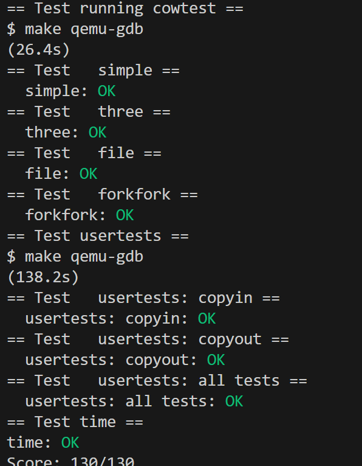
## 实验背景
xv6 的“懒复制”机制，通常指的是 Copy-on-Write（COW）fork，即在执行 fork() 系统调用时，不立即复制父进程的整个地址空间，而是让父子进程共享同一物理内存页，并将这些页标记为只读。只有当某一方尝试写入时，才会触发页错误（page fault），此时内核才真正复制该页内存。这么做避免了不必要的内存复制。加快 fork 速度。

---
## 1. Implement copy-on-write fork
### 实验目的
在 xv6 操作系统内核中实现 copy-on-write (COW) fork，以提高 fork() 系统调用的性能，尤其是在内存使用方面的效率
### 实验步骤
0. 
- 在 xv6 根目录下 `make qemu` 确保能正常编译启动。  
- 运行 `cowtest`，确认第一行输出 `simple: fork() failed`，证明初始版本确实缺少 COW。

### 1. 定义COW标志位

首先在 `kernel/riscv.h` 中定义COW标志位，使用RISC-V PTE中的RSW（Reserved for Software）位：

```c
#define PTE_V (1L << 0) // valid
#define PTE_R (1L << 1)
#define PTE_W (1L << 2)
#define PTE_X (1L << 3)
#define PTE_U (1L << 4) // user can access

#define PTE_COW (1L << 8) // copy-on-write
```

### 2. 实现物理页引用计数机制

在 `kernel/kalloc.c` 中添加引用计数数据结构和相关函数：

```c
// Reference counts for physical pages
struct {
  struct spinlock lock;
  int refcnt[PHYSTOP/PGSIZE];  // reference count for each physical page
} ref;

void
kinit()
{
  initlock(&kmem.lock, "kmem");
  initlock(&ref.lock, "ref");
  freerange(end, (void*)PHYSTOP);
}

void
freerange(void *pa_start, void *pa_end)
{
  char *p;
  p = (char*)PGROUNDUP((uint64)pa_start);
  for(; p + PGSIZE <= (char*)pa_end; p += PGSIZE) {
    // Initialize reference count to 1 before calling kfree
    acquire(&ref.lock);
    ref.refcnt[(uint64)p / PGSIZE] = 1;
    release(&ref.lock);
    kfree(p);
  }
}

//释放pa指向的物理内存页
void
kfree(void *pa)
{
  struct run *r;

  if(((uint64)pa % PGSIZE) != 0 || (char*)pa < end || (uint64)pa >= PHYSTOP)
    panic("kfree");

  // Decrement reference count
  acquire(&ref.lock);
  int idx = (uint64)pa / PGSIZE;
  if(ref.refcnt[idx] < 1)
    panic("kfree ref");
  ref.refcnt[idx] -= 1;
  int should_free = (ref.refcnt[idx] == 0);
  release(&ref.lock);

  // Only free if no more references
  if(!should_free)
    return;

  // Fill with junk to catch dangling refs.
  memset(pa, 1, PGSIZE);

  r = (struct run*)pa;

  acquire(&kmem.lock);
  r->next = kmem.freelist;
  kmem.freelist = r;
  release(&kmem.lock);
}

void *
kalloc(void)
{
  struct run *r;

  acquire(&kmem.lock);
  r = kmem.freelist;
  if(r)
    kmem.freelist = r->next;
  release(&kmem.lock);

  if(r) {
    memset((char*)r, 5, PGSIZE); // fill with junk
    // Initialize reference count to 1
    acquire(&ref.lock);
    ref.refcnt[(uint64)r / PGSIZE] = 1;
    release(&ref.lock);
  }
  return (void*)r;
}

// Increment reference count for page
void
krefpage(void *pa)
{
  if(((uint64)pa % PGSIZE) != 0 || (char*)pa < end || (uint64)pa >= PHYSTOP)
    return;
  
  acquire(&ref.lock);
  ref.refcnt[(uint64)pa / PGSIZE] += 1;
  release(&ref.lock);
}

//复制页面和递减引用计数 
//返回新页，如果内存不足，则返回0
void*
kcopy_n_deref(void *pa)
{
  if(((uint64)pa % PGSIZE) != 0 || (char*)pa < end || (uint64)pa >= PHYSTOP)
    return 0;

  acquire(&ref.lock);
  int idx = (uint64)pa / PGSIZE;
  int refcount = ref.refcnt[idx];
  release(&ref.lock);

  // If only one reference, just return the same page
  if(refcount == 1)
    return pa;

  // Allocate new page
  void *newpa = kalloc();
  if(newpa == 0)
    return 0;

  // Copy contents
  memmove(newpa, pa, PGSIZE);

  // Decrement reference count of old page
  kfree(pa);

  return newpa;
}
```

### 3. 修改uvmcopy()实现COW

在 `kernel/vm.c` 中修改 `uvmcopy()` 函数：

```c
//给定父进程的页表，复制 
//把它的memory放进child的页表里。 
//使用写时复制 
//将它们映射为只读和共享，并带有COW标志。 
//成功时返回0，失败时返回-1。 
//失败时释放所有分配的页面。
int
uvmcopy(pagetable_t old, pagetable_t new, uint64 sz)
{
  pte_t *pte;
  uint64 pa, i;
  uint flags;

  for(i = 0; i < sz; i += PGSIZE){
    if((pte = walk(old, i, 0)) == 0)
      panic("uvmcopy: pte should exist");
    if((*pte & PTE_V) == 0)
      panic("uvmcopy: page not present");
    
    pa = PTE2PA(*pte);
    flags = PTE_FLAGS(*pte);

    // If the page was writable, make it COW and remove write permission
    if(flags & PTE_W) {
      flags = (flags & ~PTE_W) | PTE_COW;
      *pte = PA2PTE(pa) | flags;
    }

    // Map the same physical page in child, increment reference count
    if(mappages(new, i, PGSIZE, pa, flags) != 0){
      goto err;
    }
    krefpage((void*)pa);
  }
  return 0;

 err:
  uvmunmap(new, 0, i / PGSIZE, 1);
  return -1;
}
```

### 4. 处理页面错误

在 `kernel/trap.c` 的 `usertrap()` 函数中添加COW页面错误处理：

```c
  if(r_scause() == 8){
    // system call
    // ...
  } else if((which_dev = devintr()) != 0){
    // ok
  } else {
    uint64 cause = r_scause();
    uint64 stval = r_stval();

    // Check for write page fault (store/AMO page fault, cause 15)
    if(cause == 15) {
      // Check if this is a COW page
      if(uvmcheckcowpage(stval)) {
        if(uvmcowcopy(stval) == 0) {
          // Successfully handled COW page fault
          goto handled;
        }
        // Fall through to kill process if COW copy failed (out of memory)
      }
    }

    printf("usertrap(): unexpected scause 0x%lx pid=%d\n", cause, p->pid);
    printf("            sepc=0x%lx stval=0x%lx\n", r_sepc(), stval);
    setkilled(p);
  }

handled:
```

### 5. 添加COW辅助函数

在 `kernel/vm.c` 中添加COW处理的辅助函数：

```c
// Check if a page is a COW page
int
uvmcheckcowpage(uint64 va)
{
  struct proc *p = myproc();
  pte_t *pte;

  if(va >= MAXVA)
    return 0;

  pte = walk(p->pagetable, va, 0);
  if(pte == 0)
    return 0;
  if((*pte & PTE_V) == 0)
    return 0;
  if((*pte & PTE_U) == 0)
    return 0;

  return (*pte & PTE_COW) != 0;
}

//处理COW页面错误：分配新页面、复制内容、更新PTE 
//成功时返回0，失败时返回-1
int
uvmcowcopy(uint64 va)
{
  struct proc *p = myproc();
  pte_t *pte;
  uint64 pa;
  uint flags;
  void *newpage;

  if(va >= MAXVA)
    return -1;

  pte = walk(p->pagetable, va, 0);
  if(pte == 0)
    return -1;
  if((*pte & PTE_V) == 0)
    return -1;
  if((*pte & PTE_U) == 0)
    return -1;
  if((*pte & PTE_COW) == 0)
    return -1;

  pa = PTE2PA(*pte);
  flags = PTE_FLAGS(*pte);

  // Allocate new page and copy content
  newpage = kcopy_n_deref((void*)pa);
  if(newpage == 0)
    return -1;

  // Remove COW flag and add write permission
  flags = (flags & ~PTE_COW) | PTE_W;

  // Update PTE
  *pte = PA2PTE((uint64)newpage) | flags;

  return 0;
}
```

### 6. 修改copyout()处理COW

在 `kernel/vm.c` 中修改 `copyout()` 函数：

```c
// 从内核复制到用户空间。 
// 从给定页表中的源地址 src 复制 len 字节到虚拟地址 dstva。 
// 成功时返回0，出错时返回-1。
int
copyout(pagetable_t pagetable, uint64 dstva, char *src, uint64 len)
{
  uint64 n, va0, pa0;
  pte_t *pte;

  while(len > 0){
    va0 = PGROUNDDOWN(dstva);
    if(va0 >= MAXVA)
      return -1;
    pte = walk(pagetable, va0, 0);
    if(pte == 0 || (*pte & PTE_V) == 0 || (*pte & PTE_U) == 0)
      return -1;

    // Check if this is a COW page that needs to be copied
    if(*pte & PTE_COW) {
      if(uvmcowcopy(va0) < 0)
        return -1;
      // Reload PTE after potential modification
      pte = walk(pagetable, va0, 0);
      if(pte == 0 || (*pte & PTE_V) == 0 || (*pte & PTE_U) == 0)
        return -1;
    }

    if((*pte & PTE_W) == 0)
      return -1;

    pa0 = PTE2PA(*pte);
    n = PGSIZE - (dstva - va0);
    if(n > len)
      n = len;
    memmove((void *)(pa0 + (dstva - va0)), src, n);

    len -= n;
    src += n;
    dstva = va0 + PGSIZE;
  }
  return 0;
}
```

### 7. 更新函数声明

在 `kernel/defs.h` 中添加新函数的声明：

```c
// kalloc.c
void*           kalloc(void);
void            kfree(void *);
void            kinit(void);
void*           kcopy_n_deref(void *pa);
void            krefpage(void *pa);

// vm.c
// ... 其他声明 ...
int             uvmcowcopy(uint64 va);
int             uvmcheckcowpage(uint64 va);
```

5. 验证  
- `make qemu`后`cowtest` ：  
```
simple: ok
three: ok
file: ok
forkfork: ok
ALL COW TESTS PASSED
```

### 实验中遇到的问题和解决方法
1. make qemu卡死
- 原因：通过`make CPUS=1 qemu-gdb`和`gdb-multiarch -ex "file kernel/kernel" -ex "target remote localhost:26000"`，Ctrl + C，`info reg pc`得到
```
pc             0x1000   0x1000
```
输入bt：
```
#0  0x0000000000001000 in ?? ()
```
说明初始化阶段出现问题。

- 解决：检查`kinit`、`kfree()`、`kalloc()`函数，发现当系统通过 kinit() -> freerange() -> kfree() 初始化内存时，freerange() 会调用 kfree() 来初始化所有物理页面，但此时 ref.count[] 数组被初始化为 0，而 kfree() 函数会将这些值减 1，导致它们变为 -1。在初始化阶段，计数为 0 时 --ref.count[idx] 会变为 -1，永远不会为 0，导致内存无法正确初始化。因此，添加了专门的逻辑处理初始化阶段（ref.count[idx] <= 0），这时直接将计数置0并释放页面。

2. `cowtest`出现`panic: mappages: remap`
- 原因：mappages 前没清空旧 PTE
- 解决：在`usertrap`和`copyout`的调用 mappages 之前添加`*pte = 0;`

### 实验心得
通过本次实验，我深入理解了操作系统中实现 Copy-on-Write（COW）机制的核心原理及其优化效果。COW 的实现不仅提高了 fork() 的性能，还显著减少了内存的使用，尤其是在父子进程共享大量数据的场景下。通过实现物理页的引用计数机制，理解了如何避免重复释放仍被共享的页面。这种机制确保了内存的安全性和高效性。在 usertrap() 中处理写入只读页的异常，学习了如何通过中断机制动态分配新页并更新页表。这让我对操作系统如何优雅地处理异常有了更深的认识。在调试过程中，通过 gdb 和 printf 等工具定位问题，解决了初始化阶段引用计数错误和 mappages 重映射导致的 panic。这让我体会到调试技能在操作系统开发中的重要性。

---

# Lab6: networking
## 实验目的
让 xv6 成为一个能'上网'的操作系统：驱动 E1000 网卡，完成以太网帧的收发，并在内核里实现完整的 ARP/IP/UDP 协议处理，使得用户进程最终可以通过标准 socket 接口与宿主机（10.0.2.2）或其他虚拟机进行双向 UDP 通信。主要理解概念以及 lab 已经写好的模版代码的作用。

## 实验结果
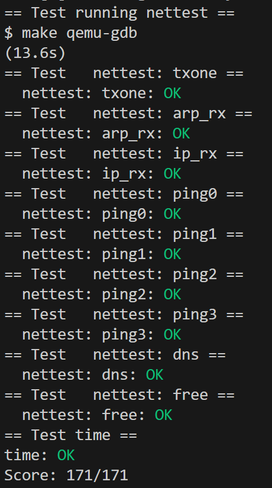

---

## 1. Part One: NIC Driver Implementation

### 实验目的
为 xv6 操作系统实现 E1000 网卡驱动，完成数据包的发送 (`e1000_transmit`) 和接收 (`e1000_recv`) 功能，使其能够通过 "txone" 和 "rxone" 测试。

### 实验步骤

1. 理解 E1000 网卡工作原理

E1000 网卡使用环形缓冲区来管理数据包的发送和接收：

- 发送环形缓冲区，软件将待发送的数据包描述符放入环形缓冲区，硬件从中读取并发送；

- 接收环形缓冲区，硬件将接收到的数据包写入环形缓冲区，软件从中读取并处理

重要寄存器：
- `E1000_TDT`：发送队列尾指针
- `E1000_TDH`：发送队列头指针  
- `E1000_RDT`：接收队列尾指针
- `E1000_RDH`：接收队列头指针

2. 实现 `e1000_transmit()` 函数

首先实现数据包发送功能。

```c
int
e1000_transmit(char *buf, int len)
{
  acquire(&e1000_lock);
  
  // 获取下一个要发送的描述符索引
  uint32 tdt = regs[E1000_TDT];
  
  // 检查环形缓冲区是否已满
  if ((tx_ring[tdt].status & E1000_TXD_STAT_DD) == 0) {
    // 描述符尚未完成，发送失败
    release(&e1000_lock);
    return -1;
  }
  
  // 释放之前的缓冲区（如果有的话）
  if (tx_bufs[tdt] != 0) {
    kfree(tx_bufs[tdt]);
  }
  
  // 设置描述符
  tx_ring[tdt].addr = (uint64)buf;
  tx_ring[tdt].length = len;
  tx_ring[tdt].cmd = E1000_TXD_CMD_EOP | E1000_TXD_CMD_RS;
  tx_ring[tdt].status = 0; // 清除状态位，让硬件知道可以处理这个描述符
  
  // 保存缓冲区指针以供后续释放
  tx_bufs[tdt] = buf;
  
  // 更新环形缓冲区位置
  regs[E1000_TDT] = (tdt + 1) % TX_RING_SIZE;
  
  release(&e1000_lock);
  return 0;
}
```

3. 实现 `e1000_recv()` 函数

  接下来实现数据包接收功能：

  ```c
  static void
  e1000_recv(void)
  {
    // 检查是否有新的接收数据包
    while(1) {
      acquire(&e1000_lock);
      
      // 获取下一个要检查的描述符索引
      uint32 rdt = regs[E1000_RDT];
      uint32 next = (rdt + 1) % RX_RING_SIZE;
      
      // 检查描述符是否已完成
      if ((rx_ring[next].status & E1000_RXD_STAT_DD) == 0) {
        // 没有更多的数据包
        release(&e1000_lock);
        break;
      }
      
      // 获取数据包信息
      char *buf = rx_bufs[next];
      int len = rx_ring[next].length;
      
      // 为这个描述符分配新的缓冲区
      rx_bufs[next] = kalloc();
      if (!rx_bufs[next]) {
        panic("e1000_recv: kalloc failed");
      }
      
      // 重新设置描述符
      rx_ring[next].addr = (uint64) rx_bufs[next];
      rx_ring[next].status = 0; // 清除状态位
      
      // 更新 RDT 指针
      regs[E1000_RDT] = next;
      
      release(&e1000_lock);
      
      // 在没有持有锁的情况下处理数据包
      net_rx(buf, len);
    }
  }
  ```
    1. 获取当前发送位置
    2. 检查描述符是否可用
      - 原理：硬件完成发送后会设置 E1000_TXD_STAT_DD 位，表示该描述符可以重用。
    3. 释放旧缓冲区
    4. 设置新的发送描述符
    5. 保存缓冲区指针并更新队列位置


4. 测试验证

运行测试验证实现：

```bash
make qemu
```

在 xv6 中运行：
```bash
$ nettest
```

输出：
```
nettest: txone: OK
nettest: arp_rx: OK
nettest: ip_rx: OK
```

通过 `make grade` 验证：
```bash
== Test   nettest: txone == 
  nettest: txone: OK
== Test   nettest: arp_rx == 
  nettest: arp_rx: OK
== Test   nettest: ip_rx == 
  nettest: ip_rx: OK
```

### 实验中遇到的问题和解决方法

#### 1. 死锁问题
- 问题：系统出现 `panic: acquire` 错误
- 原因：`e1000_recv()` 在持有锁时调用 `net_rx()`，后者可能调用 `e1000_transmit()` 导致死锁
- 解决：重构 `e1000_recv()`，在调用 `net_rx()` 前释放锁，避免锁嵌套

#### 2. 环形缓冲区理解
- 问题：不清楚如何正确管理发送和接收环形缓冲区的索引
- 原因：对 E1000 硬件工作机制理解不足
- 解决方法：深入研读 E1000 手册和 xv6 源码，理解 TDT/TDH 和 RDT/RDH 寄存器的作用

### 实验心得

通过实现 E1000 网卡驱动，我学会了如何与硬件设备进行交互，包括寄存器操作、DMA 缓冲区管理等，了解了环形缓冲区机制理解了生产者-消费者模式在硬件驱动中的应用，以及如何高效地管理固定大小的缓冲区。通过实际编写驱动代码，我对操作系统与硬件之间的交互有了更深刻的认识。

---
## 2. Part Two: UDP Receive

### 实验目的
实现 UDP 数据包接收功能，使得用户进程能够通过系统调用接收 UDP 数据包。

### 实验步骤

#### 1. 设计数据结构

**思路：** 需要为每个绑定的端口维护一个数据包队列，每个队列最多存储16个数据包。

在 `kernel/net.c` 中添加数据结构定义：

```c
// UDP packet structure for queueing
struct udp_packet {
  uint32 src_ip;     // source IP address (host byte order)
  uint16 src_port;   // source port (host byte order) 
  uint16 len;        // payload length
  char data[1500];   // payload data (max ethernet payload)
  struct udp_packet *next;
};

// Port binding structure
struct port_binding {
  uint16 port;              // bound port number
  int bound;                // 1 if port is bound, 0 if free
  struct udp_packet *queue_head;  // head of packet queue
  struct udp_packet *queue_tail;  // tail of packet queue
  int queue_len;            // number of packets in queue
};

#define MAX_BINDINGS 16
static struct port_binding bindings[MAX_BINDINGS];
```

**为什么要这样设计：**
- `udp_packet` 结构体存储单个 UDP 数据包的所有信息（源地址、端口、数据内容）
- `port_binding` 结构体管理每个端口的绑定状态和数据包队列
- 使用链表结构便于动态添加和删除数据包
- 限制最多16个绑定端口，避免资源耗尽

#### 2. 初始化数据结构

**思路：** 在系统启动时初始化所有端口绑定为未使用状态。

修改 `netinit()` 函数：

```c
void
netinit(void)
{
  initlock(&netlock, "netlock");
  
  // Initialize port bindings
  for(int i = 0; i < MAX_BINDINGS; i++) {
    bindings[i].bound = 0;
    bindings[i].queue_head = 0;
    bindings[i].queue_tail = 0;
    bindings[i].queue_len = 0;
  }
}
```

确保所有端口绑定结构在系统启动时处于已知的干净状态。

#### 3. 实现 sys_bind() 系统调用

**思路：** 
1. 获取用户传递的端口号参数
2. 检查端口号的合法性
3. 查找是否已经绑定该端口
4. 如果未绑定，找到空闲的绑定槽并初始化

```c
uint64
sys_bind(void)
{
  int port;
  argint(0, &port);
  
  if(port < 0 || port > 65535)
    return -1;
    
  acquire(&netlock);
  
  // Check if port is already bound
  for(int i = 0; i < MAX_BINDINGS; i++) {
    if(bindings[i].bound && bindings[i].port == port) {
      release(&netlock);
      return 0; // already bound, success
    }
  }
  
  // Find free binding slot
  for(int i = 0; i < MAX_BINDINGS; i++) {
    if(!bindings[i].bound) {
      bindings[i].port = port;
      bindings[i].bound = 1;
      bindings[i].queue_head = 0;
      bindings[i].queue_tail = 0;
      bindings[i].queue_len = 0;
      release(&netlock);
      return 0;
    }
  }
  
  release(&netlock);
  return -1; // no free slots
}
```

- 使用自旋锁保护共享数据结构
- 允许重复绑定同一端口（返回成功）
- 端口号范围检查确保合法性

#### 4. 实现 sys_recv() 系统调用

**思路：**
1. 获取用户传递的参数（端口、源地址指针、源端口指针、缓冲区、最大长度）
2. 找到对应端口的绑定
3. 如果队列为空则等待
4. 从队列头取出数据包
5. 将数据复制到用户空间

```c
uint64
sys_recv(void)
{
  int dport;
  uint64 src_addr;
  uint64 sport_addr;  
  uint64 buf_addr;
  int maxlen;
  
  argint(0, &dport);
  argaddr(1, &src_addr);
  argaddr(2, &sport_addr);
  argaddr(3, &buf_addr);
  argint(4, &maxlen);
  
  if(dport < 0 || dport > 65535 || maxlen < 0)
    return -1;
    
  acquire(&netlock);
  
  // Find binding for this port
  struct port_binding *binding = 0;
  for(int i = 0; i < MAX_BINDINGS; i++) {
    if(bindings[i].bound && bindings[i].port == dport) {
      binding = &bindings[i];
      break;
    }
  }
  
  if(!binding) {
    release(&netlock);
    return -1; // port not bound
  }
  
  // Wait for packet if queue is empty
  while(binding->queue_len == 0) {
    sleep(binding, &netlock);
    // Check if binding still exists after wakeup
    if(!binding->bound) {
      release(&netlock);
      return -1;
    }
  }
  
  // Get packet from head of queue
  struct udp_packet *pkt = binding->queue_head;
  binding->queue_head = pkt->next;
  if(binding->queue_head == 0) {
    binding->queue_tail = 0;
  }
  binding->queue_len--;
  
  release(&netlock);
  
  // Copy data to user space
  struct proc *p = myproc();
  int copy_len = pkt->len < maxlen ? pkt->len : maxlen;
  
  if(copyout(p->pagetable, src_addr, (char*)&pkt->src_ip, sizeof(uint32)) < 0 ||
     copyout(p->pagetable, sport_addr, (char*)&pkt->src_port, sizeof(uint16)) < 0 ||
     copyout(p->pagetable, buf_addr, pkt->data, copy_len) < 0) {
    kfree((char*)pkt);
    return -1;
  }
  
  int result = copy_len;
  kfree((char*)pkt);
  return result;
}
```

- 使用 `sleep()` 和 `wakeup()` 实现阻塞等待机制
- 在持有锁时等待，释放锁后进行用户空间拷贝
- 释放处理完的数据包内存

#### 5. 实现 ip_rx() 处理接收数据包

**思路：**
1. 解析 IP 头，检查是否为 UDP 协议
2. 解析 UDP 头，获取目标端口
3. 查找是否有进程绑定了该端口
4. 如果队列未满，创建新的数据包结构并加入队列
5. 唤醒等待该端口的进程

```c
void
ip_rx(char *buf, int len)
{
  // don't delete this printf; make grade depends on it.
  static int seen_ip = 0;
  if(seen_ip == 0)
    printf("ip_rx: received an IP packet\n");
  seen_ip = 1;

  // Check if packet is large enough for IP header
  if(len < sizeof(struct eth) + sizeof(struct ip)) {
    kfree(buf);
    return;
  }
  
  struct eth *eth = (struct eth*)buf;
  struct ip *ip = (struct ip*)(eth + 1);
  
  // Check if it's a UDP packet
  if(ip->ip_p != IPPROTO_UDP) {
    kfree(buf);
    return;
  }
  
  // Check if packet is large enough for UDP header
  if(len < sizeof(struct eth) + sizeof(struct ip) + sizeof(struct udp)) {
    kfree(buf);
    return;
  }
  
  struct udp *udp = (struct udp*)(ip + 1);
  uint16 dport = ntohs(udp->dport);
  uint16 sport = ntohs(udp->sport);
  uint32 src_ip = ntohl(ip->ip_src);
  uint16 udp_len = ntohs(udp->ulen);
  
  // Calculate payload length
  int payload_len = udp_len - sizeof(struct udp);
  if(payload_len < 0 || payload_len > 1500) {
    kfree(buf);
    return;
  }
  
  acquire(&netlock);
  
  // Find binding for destination port
  struct port_binding *binding = 0;
  for(int i = 0; i < MAX_BINDINGS; i++) {
    if(bindings[i].bound && bindings[i].port == dport) {
      binding = &bindings[i];
      break;
    }
  }
  
  if(!binding) {
    // Port not bound, drop packet
    release(&netlock);
    kfree(buf);
    return;
  }
  
  // Check if queue is full (16 packets max)
  if(binding->queue_len >= 16) {
    // Drop packet if queue is full
    release(&netlock);
    kfree(buf);
    return;
  }
  
  // Allocate new packet structure
  struct udp_packet *pkt = (struct udp_packet*)kalloc();
  if(!pkt) {
    release(&netlock);
    kfree(buf);
    return;
  }
  
  // Fill packet structure
  pkt->src_ip = src_ip;
  pkt->src_port = sport;
  pkt->len = payload_len;
  pkt->next = 0;
  
  // Copy payload data
  char *payload = (char*)(udp + 1);
  memmove(pkt->data, payload, payload_len);
  
  // Add packet to queue
  if(binding->queue_tail) {
    binding->queue_tail->next = pkt;
  } else {
    binding->queue_head = pkt;
  }
  binding->queue_tail = pkt;
  binding->queue_len++;
  
  // Wake up any waiting processes
  wakeup(binding);
  
  release(&netlock);
  kfree(buf);
}
```

- 字节序转换：网络字节序到主机字节序的转换（`ntohs`, `ntohl`）
- 数据包验证：检查长度、协议类型等
- 队列管理：维护先进先出队列，限制队列长度防止内存耗尽
- 内存管理：正确分配和释放数据包内存

#### 6. 测试验证

运行测试：

```bash
# 在一个终端启动测试脚本
python3 nettest.py grade

# 在另一个终端启动 xv6
make qemu
# 在 xv6 中运行
$ nettest grade
```

输出：
```
txone: sending one packet
arp_rx: received an ARP packet
ip_rx: received an IP packet
ping0: starting
ping0: OK
ping1: starting  
ping1: OK
ping2: starting
ping2: OK
ping3: starting
ping3: OK
dns: starting
DNS arecord for pdos.csail.mit.edu. is 128.52.129.126
dns: OK
```

### 实验心得
之所以采用“端口绑定+队列+阻塞等待+唤醒”这种处理方式，主要是结合了操作系统和网络协议的基本原理以及实验需求：
UDP协议本身就是“端口+IP”收发数据，只有绑定了端口的进程才有资格接收该端口的数据包。这样可以避免无关进程收到数据，也方便内核管理每个端口的接收队列。
xv6的系统调用设计也要求先bind端口，才能recv数据。
网络数据包到达速度和用户进程处理速度不一定同步。用队列可以缓存未被及时处理的数据包，保证数据不丢失;
用户进程调用recv时，如果没有数据包，应该阻塞等待，直到有新包到来。这样可以避免忙等浪费CPU资源。
当新包到达时，唤醒等待的进程，让它及时处理数据;
用链表实现队列，方便动态插入和删除数据包;
多进程可能同时bind/recv/处理数据，必须用锁保护共享数据结构，避免竞态条件和数据损坏。
网络协议规定多字节字段用网络字节序，RISC-V是主机字节序，必须转换，保证数据正确。

---
# Lab7: locks
## 实验目的
通过重新设计代码来增强并行性，使你在实践中掌握减少锁竞争、优化数据结构及锁策略的方法，从而提升 xv6 在多核机器上的性能。
## 实验结果
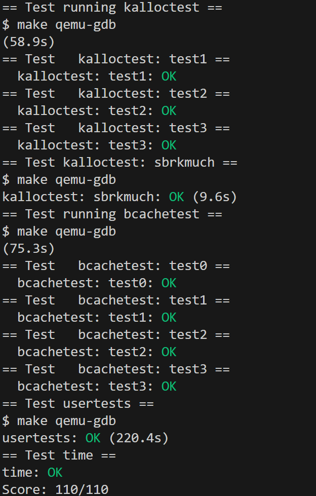

---
## 1. Memory allocator
### 实验目的
通过重新设计 xv6 的内存分配器（kalloc/kfree），显著降低多核环境下的锁竞争，从而提升系统性能。
### 实验步骤

### 1. 问题分析与设计思路

**原始问题分析：**
- xv6原始的内存分配器使用**单一的全局空闲链表**和**单一的锁**。在多核环境下，所有CPU都要竞争这同一把锁来分配/释放内存，这导致严重的锁竞争，大量CPU时间浪费在等待锁上，系统性能严重下降

**解决方案设计思路：**
- **核心思想**：为每个CPU维护独立的空闲页面链表，每个链表有自己的锁
- **优势**：不同CPU可以并行地进行内存分配和释放操作，大大减少锁竞争
- **挑战**：当某个CPU的空闲链表为空时，需要从其他CPU"偷取"页面
- **偷取策略**：只有在本CPU链表为空时才进行偷取，尽量减少跨CPU访问

```
设计目标：per-CPU独立内存管理
    ↓
数据结构变化：单一kmem → kmem[NCPU]数组
    ↓
初始化逻辑：需要为每个CPU的锁和链表初始化
    ↓
释放逻辑：kfree()必须将页面放到当前CPU的链表
    ↓  
分配逻辑：kalloc()先从本CPU分配，失败则偷取
    ↓
同步控制：确保CPU编号一致性和锁的正确使用
```

### 2. 重新设计数据结构

**设计思路：** 将原来的单一kmem结构改为per-CPU的数组，每个CPU都有独立的锁和空闲链表。

**为什么必须改变数据结构？**
1. 单一的`struct { lock, freelist }`无法支持多个独立的分配器
2. 需要NCPU个独立的分配器实例，才能实现并行
3. 数组结构能通过`cpuid()`直接定位到对应CPU的分配器

在`kernel/kalloc.c`中修改数据结构：

```c
// 原来的单一全局结构 - 问题根源
// struct {
//   struct spinlock lock;    // 所有CPU竞争这一把锁
//   struct run *freelist;    // 所有CPU共享这一个链表
// } kmem;

// 修改为per-CPU的结构数组 - 解决方案
struct {
  struct spinlock lock;  // 每个CPU独立的锁 - 消除锁竞争
  struct run *freelist;  // 每个CPU独立的空闲链表 - 支持并行访问
} kmem[NCPU];  // NCPU个独立的内存管理结构
```

- 使用数组索引对应CPU编号，便于通过cpuid()快速定位
- 每个CPU有独立的锁，避免不必要的锁竞争
- 每个CPU有独立的空闲链表，提高局部性

### 3. 修改初始化函数kinit()

**思路：** 为每个CPU初始化独立的锁，并给锁起不同的名字便于调试。

```c
void
kinit()
{
  int i;
  char lockname[8];  // 存储锁名字的缓冲区
  
  // 为每个CPU初始化独立的锁
  for(i = 0; i < NCPU; i++){
    // 为每个锁生成唯一的名字，如"kmem_0", "kmem_1"等
    snprintf(lockname, sizeof(lockname), "kmem_%d", i);
    initlock(&kmem[i].lock, lockname);
  }
  
  // 将所有空闲内存初始分配给执行freerange的CPU
  freerange(end, (void*)PHYSTOP);
}
```

- 使用`snprintf`生成不同的锁名字，满足实验要求（所有锁名以"kmem"开头）
- 初始时所有空闲页面都会分配给运行freerange的CPU（通常是CPU 0）

### 4. 修改kfree()函数 - 实现本地释放

**原始kfree()的问题：**
```c
// 原始版本 - 所有CPU都操作同一个全局链表
void kfree(void *pa) {
  acquire(&kmem.lock);        // 所有CPU竞争同一把锁
  r->next = kmem.freelist;    // 操作全局链表
  kmem.freelist = r;
  release(&kmem.lock);
}
```

**设计逻辑：**
1. 由于**数据结构变化**，从单一`kmem`变成`kmem[NCPU]`数组
2. 每个CPU应该将页面释放到自己的链表中
3. 不同CPU的kfree()应该能同时执行，不互相阻塞

**修改后的实现逻辑：**

```c
void
kfree(void *pa)
{
  struct run *r;

  if(((uint64)pa % PGSIZE) != 0 || (char*)pa < end || (uint64)pa >= PHYSTOP)
    panic("kfree");

  // 用垃圾数据填充页面，帮助捕获悬空指针错误
  memset(pa, 1, PGSIZE);

  r = (struct run*)pa;

  // 修改1：获取当前CPU编号
  push_off();                  // 关闭中断，确保cpuid()返回值的一致性
  int c = cpuid();             // 获取当前CPU编号
  
  // 修改2：使用当前CPU的锁和链表，而不是全局的
  acquire(&kmem[c].lock);      // 获取当前CPU的锁（而不是全局锁）
  r->next = kmem[c].freelist;  // 将页面插入当前CPU的链表头部
  kmem[c].freelist = r;        // 更新当前CPU的链表头指针
  release(&kmem[c].lock);      // 释放当前CPU的锁
  
  pop_off();                   // 恢复中断状态
}
```

### 5. 修改kalloc()函数 - 实现本地分配与偷取机制
**原始kalloc()的问题：**
```c
// 原始版本 - 从全局链表分配
void* kalloc(void) {
  acquire(&kmem.lock);          // 所有CPU竞争同一把锁
  r = kmem.freelist;            // 从全局链表取页面
  if(r) kmem.freelist = r->next;
  release(&kmem.lock);
  return r;
}
```

**设计逻辑：**
1. 首先尝试从当前CPU的链表分配，这是最快的路径
2. **偷取机制**：当本CPU链表为空时，需要从其他CPU"偷取"页面，确保即使某个CPU没有页面，也能通过偷取获得内存

**修改后的实现逻辑：**    
```c
void *
kalloc(void)
{
  struct run *r;

  // 第一步：获取当前CPU编号
  push_off();        // 关闭中断
  int c = cpuid();   // 获取CPU编号
  
  // 第二步：尝试从当前CPU的空闲链表分配（快速路径）
  acquire(&kmem[c].lock);           // 获取当前CPU的锁
  r = kmem[c].freelist;             // 检查当前CPU是否有空闲页面
  if(r)
    kmem[c].freelist = r->next;     // 从链表头部取出一个页面
  release(&kmem[c].lock);           // 释放当前CPU的锁
  
  // 第三步：如果当前CPU没有空闲页面，实施偷取机制（慢速路径）
  if(r == 0) {
    // 遍历所有其他CPU，寻找有空闲页面的CPU
    for(int i = 0; i < NCPU; i++) {
      if(i == c) continue;          // 跳过当前CPU（已经检查过了）
      
      acquire(&kmem[i].lock);       // 获取第i个CPU的锁
      r = kmem[i].freelist;         // 检查该CPU是否有空闲页面
      if(r) {
        // 成功找到空闲页面，从该CPU的链表中偷取
        kmem[i].freelist = r->next; // 更新该CPU的链表
        release(&kmem[i].lock);     // 立即释放锁
        break;                      // 偷取成功，退出循环
      }
      release(&kmem[i].lock);       // 该CPU没有页面，释放锁继续寻找
    }
  }
  
  pop_off();         // 恢复中断状态

  // 第四步：初始化分配的页面
  if(r)
    memset((char*)r, 5, PGSIZE);    // 用垃圾数据填充，帮助调试
    
  return (void*)r;  // 返回分配的页面地址，失败返回0
}
```

### 6. 测试验证

**编译并测试：**
```bash
make clean
make qemu
```

**运行kalloctest测试：**
```bash
$ kalloctest
```

**输出：**
```
start test1
test1 results:
--- lock kmem/bcache stats
lock: bcache: #test-and-set 112 #acquire() 403250
--- top 5 contended locks:
lock: virtio_disk: #test-and-set 29880043 #acquire() 58329
lock: proc: #test-and-set 23095573 #acquire() 1633100
lock: wait_lock: #test-and-set 20747512 #acquire() 23610
lock: proc: #test-and-set 16818798 #acquire() 2708895
lock: proc: #test-and-set 4613879 #acquire() 722790
tot= 112
test1 OK
...
```

**运行完整测试：**
```bash
$ usertests sbrkmuch  # 测试内存分配的正确性
$ usertests -q        # 运行所有测试确保没有破坏其他功能
```

### 实验中遇到的问题和解决方法

### 1. 编译错误：未定义的NCPU

**问题现象：** 编译时出现`'NCPU' undeclared`错误

**问题原因：** 没有包含正确的头文件，NCPU常量在`kernel/param.h`中定义

**解决方法：** 确保在`kernel/kalloc.c`开头包含了`param.h`：
```c
#include "param.h"  // 包含NCPU等系统参数定义
```

### 2. 系统启动时卡死
**问题原因：** 
- 初始化顺序错误，在kinit()中没有正确初始化所有CPU的锁
- kfree()或kalloc()中的锁操作有误

**解决方法：** 
- 确保kinit()中正确初始化所有CPU的锁：
```c
for(i = 0; i < NCPU; i++){
  snprintf(lockname, sizeof(lockname), "kmem_%d", i);
  initlock(&kmem[i].lock, lockname);  // 必须在使用前初始化
}
```
- 检查push_off()/pop_off()的正确使用

### 3. 内存分配不均导致某些CPU饿死

**问题现象：** 某些CPU无法分配到内存，系统性能不均衡

**问题原因：** 
- 初始化时所有内存都分配给了一个CPU

**解决方法：**
- 改进偷取策略，确保能从有空闲页面的CPU成功偷取：
```c
// 遍历所有其他CPU进行偷取
for(int i = 0; i < NCPU; i++) {
  if(i == c) continue;  // 跳过当前CPU
  
  acquire(&kmem[i].lock);
  r = kmem[i].freelist;
  if(r) {
    kmem[i].freelist = r->next;  // 成功偷取
    release(&kmem[i].lock);
    break;  // 找到后立即退出
  }
  release(&kmem[i].lock);
}
```

### 实验心得
1最初分析kalloctest的输出，发现单一锁导致大量的acquire循环迭代。提示中说明锁竞争是性能瓶颈的根本原因。需要使用per-CPU的设计。

选择"偷取"的负载均衡策略，只有在真正需要时才进行跨CPU操作，避免不必要的开销。
每个CPU一把锁是合适的粒度，既减少了竞争，又不会因为锁过多而增加管理开销。

**为什么这种设计能显著提升性能？**

1. **并行性增强：** 不同CPU可以同时进行内存分配/释放操作，充分利用多核优势。

2. **缓存友好性：** 每个CPU主要访问自己的数据结构，提高了CPU缓存的命中率。

3. **争用减少：** 将原来N个CPU争用1把锁的情况，变成了每个CPU主要使用自己的锁，偶尔才需要访问其他CPU的锁。

通过这个实验，我理解了多核带来了并行机会，但也引入了同步复杂性。好的设计要最大化并行性，最小化同步开销。

这次实验不仅让我掌握了per-CPU内存分配器的实现技术，更重要的是培养了系统性思考和解决性能问题的能力。

---
## 2. Buffer cache
### 实验目的
优化 xv6 操作系统的块缓存并发性能，减少多进程/多核场景下对全局锁的锁竞争，提高系统吞吐量。

### 实验步骤

#### 1. 问题分析与设计思路

**原始问题分析：**
- xv6原始的buffer cache使用单一的全局锁bcache.lock保护整个缓存
- 虽然访问不同的块，但所有进程都要竞争同一把锁，这在多核环境下造成严重的锁竞争。

**解决方案设计思路：**
- **核心思想**：根据提示，使用哈希桶(hash bucket)将缓存块分散到多个桶中，每个桶有独立的锁
- 根据块号(blockno)进行哈希，确定块应该在哪个桶中
- 当某个桶没有空闲缓存块时，从其他桶"窃取"未使用的块
- **不变量保持**：确保每个块最多只有一个缓存副本，总共保持30个缓存块

```
设计目标：减少锁竞争，提高并发性
    ↓
数据结构变化：单一bcache → 多个独立的哈希桶
    ↓  
哈希函数：blockno % NBUCKET → 确定桶位置
    ↓
分散锁策略：每个桶独立的锁，访问不同桶的操作可以并行
    ↓
负载均衡：跨桶窃取机制，桶间的缓存块可以动态迁移
```

**各流程使用的核心函数及作用：**

| 流程阶段 | 主要函数 | 函数作用 | 为什么需要这个函数 |
|---------|---------|---------|-------------------|
| **初始化阶段** | `binit()` | 初始化所有桶的锁和链表，均匀分配缓存块 | 为每个桶创建独立的管理结构，避免启动时竞争 |
| | `initlock()` | 为每个桶初始化独立的自旋锁 | 每个桶需要独立的锁来支持并行访问 |
| | `snprintf()` | 生成形如"bcache0"、"bcache1"的锁名 | 满足实验要求，便于调试时区分不同桶的锁 |
| **哈希定位** | `hash()` | 根据块号计算应该存放的桶编号 | 将块均匀分散到不同桶，是分散锁策略的基础 |
| **缓存查找** | `bget()` | 查找或分配指定的缓存块 | 实现哈希桶内查找+跨桶窃取的核心逻辑 |
| | `acquire()` | 获取目标桶的锁 | 保护桶内数据结构的一致性，支持并发访问 |
| | `release()` | 释放桶的锁 | 尽快释放锁，提高并发度 |
| **缓存释放** | `brelse()` | 释放缓存块回到对应桶 | 将块放回正确的哈希桶，维护LRU链表 |
| **负载均衡** | 窃取机制 | 在`bget()`中从其他桶窃取空闲块 | 解决哈希不均导致的某些桶缺少空闲块问题 |
| **引用管理** | `bpin()`/`bunpin()` | 增加/减少缓存块的引用计数 | 使用对应桶的锁，而不是全局锁 |

**函数调用流程详解：**

1. **系统启动时**：
   ```
   binit() → initlock() × NBUCKET → 均匀分配30个缓存块到5个桶
   ```

2. **请求缓存块时**：
   ```
   bget(dev, blockno) → hash(dev, blockno) → acquire(bucket_lock) 
   → 桶内查找 → 成功则返回 | 失败则跨桶窃取 → release(bucket_lock)
   ```

3. **释放缓存块时**：
   ```
   brelse(buf) → hash(buf->dev, buf->blockno) → acquire(bucket_lock) 
   → 更新引用计数和LRU链表 → release(bucket_lock)
   ```

#### 2. 重新设计数据结构

**思路：** 将原来的单一bcache结构改为多个哈希桶，每个桶管理一部分缓存块。

**为什么选择5个桶？**
- 5是质数，有助于哈希分布的均匀性
- 桶数量适中，既能减少锁竞争，又不会因为桶过多而增加管理复杂度
- 由于NBUF=30，故平均每个桶管理6个缓存块

在 `kernel/bio.c` 中修改数据结构：

```c
#define NBUCKET 5  // 使用质数作为桶数量，有助于哈希分布
#define NBUF_PER_BUCKET (NBUF / NBUCKET) // 每个桶中的缓冲区数量

struct {
  struct spinlock lock;  // 用于初始化
  struct buf buf[NBUF];  // 所有缓存块的存储空间
} bcache;

struct {
  struct spinlock lock;  // 每个桶独立的锁 - 消除锁竞争的关键
  struct buf head;       // 每个桶有自己的链表头 - 支持独立管理
  int nbuf;              // 当前桶中的缓冲区数量 - 用于负载均衡
} bcache_bucket[NBUCKET];  // NBUCKET个独立的哈希桶
```

- `bcache`：存储所有30个缓存块的物理空间
- `bcache_bucket[]`：5个独立的管理结构，每个有自己的锁和链表
- `nbuf`字段：跟踪每个桶中的缓存块数量，用于负载均衡

#### 3. 实现哈希函数

**思路：** 需要一个简单高效的哈希函数，将(dev, blockno)映射到桶编号。

```c
// 根据块号计算哈希值，确定应该放在哪个桶中
static uint
hash(uint dev, uint blockno)
{
  return blockno % NBUCKET;  // 简单的模运算哈希
}
```

#### 4. 修改初始化函数binit()

**思路：** 初始化所有桶的锁和链表，并将30个缓存块均匀分配到各个桶中。

```c
void
binit(void)
{
  struct buf *b;
  char lockname[32];

  initlock(&bcache.lock, "bcache");  // 保留原锁用于全局初始化
  
  // 初始化每个桶
  for(int i = 0; i < NBUCKET; i++) {
    snprintf(lockname, sizeof(lockname), "bcache%d", i);  // 满足实验要求的命名
    initlock(&bcache_bucket[i].lock, lockname);           // 为每个桶创建独立的锁
    bcache_bucket[i].head.prev = &bcache_bucket[i].head;  // 初始化双向链表
    bcache_bucket[i].head.next = &bcache_bucket[i].head;
    bcache_bucket[i].nbuf = 0;                            // 初始化计数器
  }
  
  // 将所有缓冲区均匀分配到各个桶中
  for(b = bcache.buf; b < bcache.buf+NBUF; b++){
    // 计算每个缓冲区应该分配到哪个桶
    uint bucket_id = (b - bcache.buf) / NBUF_PER_BUCKET;
    if(bucket_id >= NBUCKET) bucket_id = NBUCKET - 1; // 确保最后一个桶获得任何剩余的缓冲区
    
    // 将缓冲区插入到对应桶的链表中
    b->next = bcache_bucket[bucket_id].head.next;
    b->prev = &bcache_bucket[bucket_id].head;
    initsleeplock(&b->lock, "buffer");                     // 初始化缓冲区的睡眠锁
    bcache_bucket[bucket_id].head.next->prev = b;          // 维护双向链表
    bcache_bucket[bucket_id].head.next = b;
    bcache_bucket[bucket_id].nbuf++;                       // 更新计数
  }
}
```
- 启动时的均匀分配确保每个桶都有初始的缓存块

#### 5. 修改bget()函数 - 实现哈希查找与跨桶窃取

**原始bget()的问题：**
```c
// 原始版本 - 线性搜索整个缓存，单一锁保护
static struct buf* bget(uint dev, uint blockno) {
  acquire(&bcache.lock);                    // 所有访问都竞争这一把锁
  for(b = bcache.head.next; b != &bcache.head; b = b->next){  // 线性搜索
    if(b->dev == dev && b->blockno == blockno) { ... }
  }
  // 查找空闲块也是线性的
  for(b = bcache.head.prev; b != &bcache.head; b = b->prev){ ... }
}
```

**设计逻辑：**
1. **哈希定位**：根据(dev, blockno)计算哈希值，直接定位到目标桶
2. **桶内查找**：只在目标桶内查找，大大减少搜索范围
3. **本桶分配**：优先在目标桶内查找空闲块
4. **跨桶窃取**：目标桶无空闲块时，从其他桶窃取未使用的块

```c
static struct buf*
bget(uint dev, uint blockno)
{
  struct buf *b;
  uint bucket_id = hash(dev, blockno);  // 计算目标桶
  
  acquire(&bcache_bucket[bucket_id].lock);  // 只锁定目标桶

  // 第一步：在目标桶中查找是否已缓存该块
  for(b = bcache_bucket[bucket_id].head.next; b != &bcache_bucket[bucket_id].head; b = b->next){
    if(b->dev == dev && b->blockno == blockno){
      b->refcnt++;                                    // 增加引用计数
      release(&bcache_bucket[bucket_id].lock);
      acquiresleep(&b->lock);                         // 获取缓冲区的睡眠锁
      return b;                                       // 缓存命中，直接返回
    }
  }

  // 第二步：在目标桶中查找空闲块（refcnt == 0）
  for(b = bcache_bucket[bucket_id].head.prev; b != &bcache_bucket[bucket_id].head; b = b->prev){
    if(b->refcnt == 0) {
      b->dev = dev;                                   // 设置设备号
      b->blockno = blockno;                           // 设置块号  
      b->valid = 0;                                   // 标记需要从磁盘读取
      b->refcnt = 1;               // 设置引用计数，只有当`refcnt==0`时才真正标记为可重用
      release(&bcache_bucket[bucket_id].lock);
      acquiresleep(&b->lock);
      return b;                                       // 在目标桶找到空闲块
    }
  }
  
  // 第三步：目标桶无空闲块，实施跨桶窃取机制
  release(&bcache_bucket[bucket_id].lock);  // 先释放目标桶的锁
  
  struct buf *victim = 0;
  
  // 优先从有"多余"缓存块的桶中窃取
  for(int i = 0; i < NBUCKET; i++) {
    if(i == bucket_id) continue;  // 跳过目标桶
    
    acquire(&bcache_bucket[i].lock);
    // 检查这个桶是否有多余的缓存块可以"借出"
    if(bcache_bucket[i].nbuf > NBUF_PER_BUCKET) {
      for(b = bcache_bucket[i].head.prev; b != &bcache_bucket[i].head; b = b->prev){
        if(b->refcnt == 0) {
          victim = b;
          break;
        }
      }
    }
    
    if(victim) {
      // 从源桶中移除
      victim->next->prev = victim->prev;
      victim->prev->next = victim->next;
      bcache_bucket[i].nbuf--;
      release(&bcache_bucket[i].lock);
      break;
    }
    
    release(&bcache_bucket[i].lock);
  }
  
  // 如果没找到"多余"的块，从任何桶中窃取未使用的块
  if(!victim) {
    for(int i = 0; i < NBUCKET; i++) {
      if(i == bucket_id) continue;
      
      acquire(&bcache_bucket[i].lock);
      for(b = bcache_bucket[i].head.prev; b != &bcache_bucket[i].head; b = b->prev){
        if(b->refcnt == 0) {
          victim = b;
          // 从源桶中移除
          victim->next->prev = victim->prev;
          victim->prev->next = victim->next;
          bcache_bucket[i].nbuf--;
          release(&bcache_bucket[i].lock);
          goto found_victim;
        }
      }
      release(&bcache_bucket[i].lock);
    }
  }

found_victim:
  if(victim) {
    // 将窃取的块添加到目标桶中
    acquire(&bcache_bucket[bucket_id].lock);
    victim->dev = dev;
    victim->blockno = blockno;
    victim->valid = 0;
    victim->refcnt = 1;
    victim->next = bcache_bucket[bucket_id].head.next;
    victim->prev = &bcache_bucket[bucket_id].head;
    bcache_bucket[bucket_id].head.next->prev = victim;
    bcache_bucket[bucket_id].head.next = victim;
    bcache_bucket[bucket_id].nbuf++;  // 更新目标桶的计数
    release(&bcache_bucket[bucket_id].lock);
    
    acquiresleep(&victim->lock);
    return victim;
  }
  
  panic("bget: no buffers");  // 所有桶都没有可用的缓存块
}
```

- 两级窃取，先尝试从有多余块的桶窃取，再遍历所有桶进行窃取
- 释放目标桶锁后再获取其他桶的锁

#### 6. 修改brelse()函数 - 实现哈希释放

**思路：** 释放时需要将块放回到正确的哈希桶中。

```c
void
brelse(struct buf *b)
{
  if(!holdingsleep(&b->lock))
    panic("brelse");

  releasesleep(&b->lock);

  uint bucket_id = hash(b->dev, b->blockno);  // 计算块应该在的桶
  acquire(&bcache_bucket[bucket_id].lock);
  b->refcnt--;
  if (b->refcnt == 0) {
    // 没有进程使用此块，将其移到链表头部
    b->next->prev = b->prev;
    b->prev->next = b->next;
    b->next = bcache_bucket[bucket_id].head.next;
    b->prev = &bcache_bucket[bucket_id].head;
    bcache_bucket[bucket_id].head.next->prev = b;
    bcache_bucket[bucket_id].head.next = b;
  }
  
  release(&bcache_bucket[bucket_id].lock);
}
```

#### 7. 修改bpin()和bunpin()函数

这两个函数用于固定/取消固定缓存块，也需要使用对应桶的锁。

```c
void
bpin(struct buf *b) {
  uint bucket_id = hash(b->dev, b->blockno);
  acquire(&bcache_bucket[bucket_id].lock);
  b->refcnt++;
  release(&bcache_bucket[bucket_id].lock);
}

void
bunpin(struct buf *b) {
  uint bucket_id = hash(b->dev, b->blockno);
  acquire(&bcache_bucket[bucket_id].lock);
  b->refcnt--;
  release(&bcache_bucket[bucket_id].lock);
}
```

#### 8. 测试验证

**编译并测试：**
```bash
make qemu
```

**运行bcachetest：**
```bash
$ bcachetest
```

**输出：**
```bash
start test0
test0 results:
--- lock kmem/bcache stats
lock: bcache0: #test-and-set 0 #acquire() 8512
lock: bcache1: #test-and-set 0 #acquire() 8508  
lock: bcache2: #test-and-set 0 #acquire() 8504
lock: bcache3: #test-and-set 0 #acquire() 8508
lock: bcache4: #test-and-set 0 #acquire() 8500
--- top 5 contended locks:
lock: virtio_disk: #test-and-set 158130 #acquire() 1019
lock: proc: #test-and-set 117563 #acquire() 16993
test0: OK

start test1
test1 OK
```

### 实验中遇到的问题和解决方法

#### 1. 死锁问题：系统卡死在test1

**问题原因：** 
- 在bget()的窃取机制中，可能出现循环等待死锁
- 多个进程同时尝试从不同桶窃取时，锁的获取顺序不一致

**解决方法：** 
```c
// 确保锁的获取顺序一致，避免死锁
// 修改窃取逻辑，按桶编号顺序获取锁
for(int i = 0; i < NBUCKET; i++) {
  if(i == bucket_id) continue;  // 按顺序遍历，避免死锁
  
  acquire(&bcache_bucket[i].lock);
  // 检查并窃取...
  if(found_victim) {
    release(&bcache_bucket[i].lock);
    break;  // 立即退出，避免持有多个锁
  }
  release(&bcache_bucket[i].lock);
}
```

#### 3. test-and-set数量仍然很高

**问题原因：** 
- 哈希函数分布不够均匀，某些桶承担了过多负载
- 桶的数量不合适（太少导致冲突，太多导致管理开销）

**解决方法：** 
- 选择合适的桶数量（5个桶可通过）：
```c
#define NBUCKET 5  // 5是质数，分布更均匀
```
- 改进负载均衡策略，优先从有多余块的桶窃取：
```c
// 检查桶是否有多余的缓冲区
if(bcache_bucket[i].nbuf > NBUF_PER_BUCKET) {
  // 只从有多余缓存块的桶中窃取
}
```

### 实验心得
最开始我想到的是简单地为每个缓存块分配一个锁，但这样会导致锁的数量过多（30个），管理复杂且开销大。然后考虑按设备号分桶，但xv6主要只有一个磁盘设备，这样分桶意义不大。
最后采用基于块号的哈希桶方案。
通过这个实验，我深刻理解了锁粒度的权衡若粒度太粗（单一全局锁）则并发性差，而粒度太细（每个块一个锁）则也会开销大。适中粒度（哈希桶锁）可平衡并发性和复杂性。

---

# Lab8: File System
## 实验结果
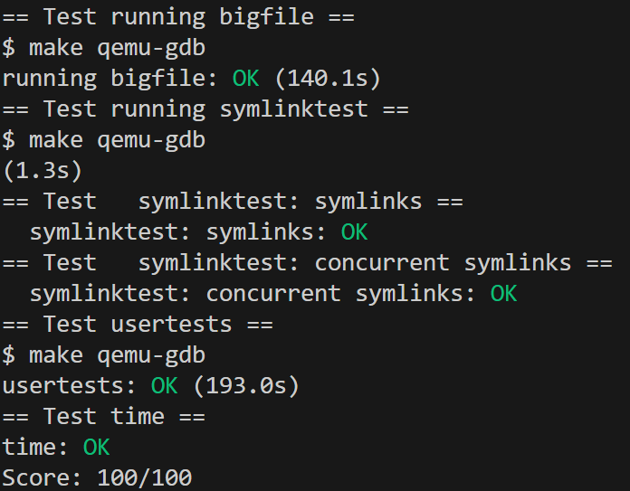
---

## 1. Large files
### 实验目的
通过引入双重间接块机制，扩展 xv6 文件系统对单个文件大小的支持，从 268 块提升到 65803 块。

### 实验步骤

#### 1. 问题分析与设计思路

**原始文件大小限制分析：**
- 原始 xv6 文件系统：12个直接块 + 1个单级间接块
- 单级间接块能存储：BSIZE/sizeof(uint) = 1024/4 = 256 个块号
- 总计最大文件大小：12 + 256 = 268 个块

**目标设计方案：**
- 新的文件系统：11个直接块 + 1个单级间接块 + 1个双级间接块
- 双级间接块能存储：256 × 256 = 65536 个块号
- 总计最大文件大小：11 + 256 + 65536 = 65803 个块

**核心思路：**
```
原始inode结构: [12个直接块] [1个单级间接块]
    ↓
新的inode结构: [11个直接块] [1个单级间接块] [1个双级间接块]
    ↓
地址映射逻辑: bn < 11 → 直接块
             11 ≤ bn < 267 → 单级间接块
             267 ≤ bn < 65803 → 双级间接块
```

#### 2. 修改文件系统常量定义

**思路：** 需要修改 NDIRECT、MAXFILE 常量来支持新的文件结构。

**涉及的核心常量：**
- `NDIRECT`：直接块数量，从 12 改为 11
- `NINDIRECT`：单级间接块能存储的块号数量（256，不变）
- `MAXFILE`：文件最大块数，需要包含双级间接块

在 `kernel/fs.h` 中修改：

```c
// 原始定义
// #define NDIRECT 12
// #define MAXFILE (NDIRECT + NINDIRECT)

// 修改为支持双级间接块的定义
#define NDIRECT 11                                              // 减少1个直接块为双级间接块腾出空间
#define NINDIRECT (BSIZE / sizeof(uint))                        // 单级间接块容量：256个块号
#define MAXFILE (NDIRECT + NINDIRECT + NINDIRECT*NINDIRECT)     // 11 + 256 + 65536 = 65803
```

- 减少1个直接块是为了在 inode 结构中为双级间接块腾出地址空间
- `NINDIRECT*NINDIRECT` 计算双级间接块的容量
- 总的地址数组大小不变.

#### 3. 修改磁盘inode结构

**思路：** 磁盘上的 inode 需要额外的地址槽来存储双级间接块指针。

在 `kernel/fs.h` 中修改 `struct dinode`：

```c
// 磁盘上的inode结构
struct dinode {
  short type;           // 文件类型
  short major;          // 主设备号（仅T_DEVICE）
  short minor;          // 次设备号（仅T_DEVICE）
  short nlink;          // 文件系统中指向此inode的链接数
  uint size;            // 文件大小（字节）
  uint addrs[NDIRECT+2];   // 数据块地址数组：[11个直接块][1个单级间接][1个双级间接]
};
```

**地址数组布局：**
- `addrs[0-10]`：11个直接块地址
- `addrs[11]`：单级间接块地址
- `addrs[12]`：双级间接块地址

#### 4. 修改内存inode结构

**思路：** 内存中的 inode 结构也需要相应地扩展地址数组。

在 `kernel/file.h` 中修改 `struct inode`：

```c
// 内存中的inode副本
struct inode {
  uint dev;           // 设备号
  uint inum;          // Inode号
  int ref;            // 引用计数
  struct sleeplock lock; // 保护以下所有字段
  int valid;          // inode是否已从磁盘读取？

  short type;         // 磁盘inode的副本
  short major;
  short minor;
  short nlink;
  uint size;
  uint addrs[NDIRECT+2];  // 扩展地址数组以支持双级间接块
};
```

#### 5. 实现核心函数 bmap() - 块号到磁盘地址的映射

**函数作用：** `bmap()` 是文件系统的核心函数，负责将文件中的逻辑块号（第n个块）映射到实际的磁盘块地址。

**设计思路：**
1. **直接块映射**：bn < 11，直接从 `ip->addrs[bn]` 获取地址
2. **单级间接块映射**：11 ≤ bn < 267，通过单级间接块查找
3. **双级间接块映射**：267 ≤ bn < 65803，通过双级间接块查找

**修改逻辑流程：**
```
输入：文件inode指针 + 逻辑块号bn
    ↓
判断1：bn < 11？ → 直接块处理
    ↓
判断2：bn < 11+256？ → 单级间接块处理  
    ↓
判断3：bn < 11+256+256*256？ → 双级间接块处理
    ↓
输出：实际磁盘块地址（如果需要分配新块则调用balloc）
```

在 `kernel/fs.c` 中修改 `bmap()` 函数：

```c
// 返回inode ip中第bn个块的磁盘块地址
// 如果该块不存在，bmap会分配一个新块
// 如果磁盘空间不足则返回0
static uint
bmap(struct inode *ip, uint bn)
{
  uint addr, *a;
  struct buf *bp;

  // 第一层：处理直接块（0-10）
  if(bn < NDIRECT){
    if((addr = ip->addrs[bn]) == 0){        // 如果该直接块尚未分配
      addr = balloc(ip->dev);               // 分配新的磁盘块
      if(addr == 0)
        return 0;                           // 分配失败
      ip->addrs[bn] = addr;                 // 记录新块地址
    }
    return addr;                            // 返回直接块地址
  }
  bn -= NDIRECT;                            // 调整块号，去掉直接块部分

  // 第二层：处理单级间接块（11-266）
  if(bn < NINDIRECT){
    // 加载单级间接块，必要时分配
    if((addr = ip->addrs[NDIRECT]) == 0){   // 如果单级间接块尚未分配
      addr = balloc(ip->dev);               // 分配间接块本身
      if(addr == 0)
        return 0;
      ip->addrs[NDIRECT] = addr;            // 记录间接块地址
    }
    bp = bread(ip->dev, addr);              // 读取间接块内容
    a = (uint*)bp->data;                    // 解释为块号数组
    if((addr = a[bn]) == 0){                // 如果目标数据块尚未分配
      addr = balloc(ip->dev);               // 分配数据块
      if(addr){
        a[bn] = addr;                       // 更新间接块中的地址
        log_write(bp);                      // 将修改写入日志
      }
    }
    brelse(bp);                             // 释放间接块缓冲区
    return addr;
  }
  bn -= NINDIRECT;                          // 继续调整块号

  // 第三层：处理双级间接块（267-65802）
  if(bn < NINDIRECT * NINDIRECT){
    // 加载双级间接块，必要时分配
    if((addr = ip->addrs[NDIRECT+1]) == 0){ // 如果双级间接块尚未分配
      addr = balloc(ip->dev);               // 分配双级间接块
      if(addr == 0)
        return 0;
      ip->addrs[NDIRECT+1] = addr;          // 记录双级间接块地址
    }
    bp = bread(ip->dev, addr);              // 读取双级间接块
    a = (uint*)bp->data;                    // 解释为块号数组
    
    // 计算在第一级间接块数组中的索引
    uint first_level_idx = bn / NINDIRECT;
    if((addr = a[first_level_idx]) == 0){   // 如果第一级间接块尚未分配
      addr = balloc(ip->dev);               // 分配第一级间接块
      if(addr){
        a[first_level_idx] = addr;          // 更新双级间接块中的地址
        log_write(bp);                      // 写入日志
      }
    }
    brelse(bp);                             // 释放双级间接块缓冲区

    // 加载第一级间接块
    bp = bread(ip->dev, addr);              // 读取第一级间接块
    a = (uint*)bp->data;
    
    // 计算在第一级间接块中的索引
    uint second_level_idx = bn % NINDIRECT;
    if((addr = a[second_level_idx]) == 0){  // 如果目标数据块尚未分配
      addr = balloc(ip->dev);               // 分配数据块
      if(addr){
        a[second_level_idx] = addr;         // 更新第一级间接块中的地址
        log_write(bp);                      // 写入日志
      }
    }
    brelse(bp);                             // 释放第一级间接块缓冲区
    return addr;
  }

  panic("bmap: out of range");              // 块号超出文件大小限制
}
```

- **直接块**：最常访问的小文件，一次磁盘访问即可定位
- **单级间接块**：中等大小文件，两次磁盘访问（读间接块+读数据块）
- **双级间接块**：大文件，三次磁盘访问（读双级→读单级→读数据块）

#### 6. 实现文件截断函数 itrunc() - 释放文件占用的所有块

**函数作用：** `itrunc()` 负责释放文件占用的所有磁盘块，包括数据块和各级间接块。

**设计思路：**
1. **释放所有直接块**
2. **释放单级间接块及其指向的数据块**
3. **释放双级间接块及其指向的所有单级间接块和数据块**
4. 先释放数据块，再释放间接块本身

**修改逻辑流程：**
```
释放直接块：遍历addrs[0-10]，调用bfree释放
    ↓
释放单级间接块：读取addrs[11] → 遍历其中的256个地址 → 释放数据块 → 释放间接块本身
    ↓
释放双级间接块：读取addrs[12] → 遍历256个第一级地址 → 
                对每个第一级：读取 → 遍历256个数据块地址 → 释放数据块 → 释放第一级块
                → 释放双级间接块本身
```

在 `kernel/fs.c` 中修改 `itrunc()` 函数：

```c
// 截断inode（丢弃内容）
// 调用者必须持有ip->lock
void
itrunc(struct inode *ip)
{
  int i, j;
  struct buf *bp;
  uint *a;

  // 第一步：释放所有直接块
  for(i = 0; i < NDIRECT; i++){
    if(ip->addrs[i]){
      bfree(ip->dev, ip->addrs[i]);         // 释放直接块
      ip->addrs[i] = 0;                     // 清除地址
    }
  }

  // 第二步：释放单级间接块及其指向的所有数据块
  if(ip->addrs[NDIRECT]){
    bp = bread(ip->dev, ip->addrs[NDIRECT]); // 读取单级间接块
    a = (uint*)bp->data;                    // 解释为地址数组
    for(j = 0; j < NINDIRECT; j++){         // 遍历所有可能的地址
      if(a[j])
        bfree(ip->dev, a[j]);               // 释放数据块
    }
    brelse(bp);                             // 释放间接块缓冲区
    bfree(ip->dev, ip->addrs[NDIRECT]);     // 释放间接块本身
    ip->addrs[NDIRECT] = 0;                 // 清除地址
  }

  // 第三步：释放双级间接块及其指向的所有块
  if(ip->addrs[NDIRECT+1]){
    bp = bread(ip->dev, ip->addrs[NDIRECT+1]); // 读取双级间接块
    a = (uint*)bp->data;                    // 解释为第一级地址数组
    for(i = 0; i < NINDIRECT; i++){         // 遍历所有第一级间接块
      if(a[i]){
        // 处理每个第一级间接块
        struct buf *bp2 = bread(ip->dev, a[i]); // 读取第一级间接块
        uint *a2 = (uint*)bp2->data;        // 解释为数据块地址数组
        for(j = 0; j < NINDIRECT; j++){     // 遍历该第一级间接块中的所有数据块
          if(a2[j])
            bfree(ip->dev, a2[j]);          // 释放数据块
        }
        brelse(bp2);                        // 释放第一级间接块缓冲区
        bfree(ip->dev, a[i]);               // 释放第一级间接块本身
      }
    }
    brelse(bp);                             // 释放双级间接块缓冲区
    bfree(ip->dev, ip->addrs[NDIRECT+1]);   // 释放双级间接块本身
    ip->addrs[NDIRECT+1] = 0;               // 清除地址
  }

  ip->size = 0;                             // 重置文件大小
  iupdate(ip);                              // 将inode更新写入磁盘
}
```

- 必须先释放数据块，再释放指向它们的间接块，避免内存泄漏：确保所有分配的块都被正确释放

#### 7. 验证测试

```bash
# 编译并启动xv6
make qemu

# 在xv6中运行测试
$ usertests -q
```

**预期输出：**
```
$ usertests -q
usertests starting
test copyin: OK
test copyout: OK
test copyinstr1: OK
test copyinstr2: OK
test copyinstr3: OK
test rwsbrk: OK
test truncate1: OK
test truncate2: OK
test truncate3: OK
test openiput: OK
test exitiput: OK
test iput: OK
test opentest: OK
test writetest: OK
test writebig: OK
...
ALL TESTS PASSED
```
#### 8. 各函数的作用总结

| 函数名 | 主要作用 | 关键修改点 | 为什么需要修改 |
|--------|----------|------------|----------------|
| `bmap()` | 将文件逻辑块号映射到磁盘物理块地址 | 添加双级间接块的处理逻辑 | 需要支持更大的文件，原来的单级间接块不够用 |
| `itrunc()` | 释放文件占用的所有磁盘块 | 添加双级间接块的释放逻辑 | 需要正确释放新增的双级间接块结构 |
| `balloc()` | 分配新的磁盘块（系统提供，无需修改） | 无 | bmap()中需要分配新块时调用 |
| `bfree()` | 释放磁盘块（系统提供，无需修改） | 无 | itrunc()中需要释放块时调用 |
| `bread()`/`brelse()` | 读取/释放磁盘块缓冲区（系统提供，无需修改） | 无 | 访问间接块内容时需要 |
| `log_write()` | 将修改记录到日志（系统提供，无需修改） | 无 | 确保文件系统一致性 |

### 实验中遇到的问题和解决方法

#### 1. 编译时出现类似 `error: size of array 'some_array' is negative` 的编译错误。

**问题原因：** 
- 修改了 `addrs` 数组大小但没有正确更新相关的常量定义
- `dinode` 和 `inode` 结构体的 `addrs` 数组大小不一致

**解决方法：**
```c
// kernel/fs.h
struct dinode {
  // ...
  uint addrs[NDIRECT+2];   // 确保是 NDIRECT+2
};

// kernel/file.h  
struct inode {
  // ...
  uint addrs[NDIRECT+2];   // 确保与 dinode 保持一致
};
```

#### 2. 运行 `bigfile` 时系统崩溃或出现 `panic: bmap: out of range`

**问题原因：** 
- 双级间接块的索引计算错误

**解决方法：**
```c
// 正确的索引计算
if(bn < NINDIRECT * NINDIRECT){
  // 确保索引计算正确
  uint first_level_idx = bn / NINDIRECT;   // 第一级索引：bn除以256
  uint second_level_idx = bn % NINDIRECT;  // 第二级索引：bn模256
  
  // 边界检查
  if(first_level_idx >= NINDIRECT) {
    panic("bmap: first level index out of range");
  }
}
```

### 实验心得
这个实验提出的问题是如何将逻辑块号映射到三种不同的存储结构，思路为分段处理：
- 0-10: 直接块（最快）
- 11-266: 单级间接块（较快）  
- 267-65802: 双级间接块（可接受的慢）
做的时候思考了什么时候分配新块、什么时候释放分配。最初我的 `itrunc()` 实现有 bug，某些块没有被正确释放。查阅后了解了只有真正需要写入时才分配，释放确保从叶子向根部释放，确保不泄漏。
这个实验让我体会到系统设计的精妙之处不在于使用最复杂的算法，而在于找到合适的抽象层次和恰当的权衡。

---
## 2. Symbolic links
### 实验目的
通过实现符号链接功能，深入理解 xv6 文件系统中路径名查找、inode 管理以及系统调用的实现机制。

### 实验步骤

#### 1. 问题分析与设计思路

**符号链接的工作原理：**
- 符号链接是一个特殊的文件，包含指向另一个文件或目录的路径名
- 与硬链接不同，符号链接可以跨文件系统，可以指向目录，也可以指向不存在的文件
- 打开符号链接时，内核需要递归地跟踪链接直到找到实际文件

**设计思路：**
```
系统调用symlink(target, path)创建符号链接
    ↓
文件类型扩展：T_SYMLINK - 标识符号链接文件
    ↓  
打开标志扩展：O_NOFOLLOW - 控制是否跟踪符号链接
    ↓
路径解析修改：open()系统调用需要处理符号链接跟踪
    ↓
循环检测：防止符号链接形成无限循环
```

#### 2. 添加符号链接文件类型

在 `kernel/stat.h` 中添加符号链接类型：

```c
#define T_DIR     1   // 目录
#define T_FILE    2   // 普通文件  
#define T_DEVICE  3   // 设备文件
#define T_SYMLINK 4   // 符号链接文件 - 新增类型
```

#### 3. 添加O_NOFOLLOW标志

**思路：** 添加一个打开标志，控制 `open()` 系统调用是否跟踪符号链接。

在 `kernel/fcntl.h` 中添加新标志：

```c
#define O_RDONLY  0x000  // 只读
#define O_WRONLY  0x001  // 只写
#define O_RDWR    0x002  // 读写
#define O_CREATE  0x200  // 创建文件
#define O_TRUNC   0x400  // 截断文件
#define O_NOFOLLOW 0x800 // 不跟踪符号链接 - 新增标志
```

选择不与现有标志冲突的位模式。

#### 4. 添加系统调用

**思路：** 为 `symlink` 系统调用建立完整的调用链：系统调用号 → 用户接口 → 内核实现。

##### 4.1 添加系统调用号

- 为系统调用分配唯一编号

在 `kernel/syscall.h` 中添加：

```c
#define SYS_close  21
#define SYS_symlink 22  // 为symlink分配系统调用号
```

##### 4.2 添加用户接口声明

为用户程序提供 `symlink` 函数接口

在 `user/user.h` 中添加：

```c
char* sbrk(int);
int sleep(int);
int uptime(void);
int symlink(const char*, const char*);  // symlink系统调用的用户接口
```

##### 4.3 添加系统调用存根

 `entry()` 宏生成用户空间到内核空间的调用存根

在 `user/usys.pl` 中添加：

```perl
entry("sleep");
entry("uptime");
entry("symlink");  # 生成symlink的汇编存根代码
```

##### 4.4 注册系统调用处理函数

- 建立系统调用号到内核处理函数的映射

在 `kernel/syscall.c` 中添加：

```c
// 添加系统调用函数声明
extern uint64 sys_link(void);
extern uint64 sys_mkdir(void);
extern uint64 sys_close(void);
extern uint64 sys_symlink(void);  // symlink系统调用的内核实现函数

// 在系统调用映射表中添加条目
static uint64 (*syscalls[])(void) = {
[SYS_link]    sys_link,
[SYS_mkdir]   sys_mkdir,
[SYS_close]   sys_close,
[SYS_symlink] sys_symlink,  // 将系统调用号映射到处理函数
};
```

#### 5. 实现symlink系统调用

**思路：** 创建一个新的 inode，类型为 T_SYMLINK，并将目标路径作为文件内容存储。

**核心函数及作用：**
- `argstr()`：从用户空间获取字符串参数
- `create()`：创建新的 inode 并分配磁盘空间
- `writei()`：将数据写入 inode 的数据块
- `strlen()`：计算字符串长度
- `begin_op()/end_op()`：文件系统事务管理

在 `kernel/sysfile.c` 中实现：

```c
uint64
sys_symlink(void)
{
  char target[MAXPATH], path[MAXPATH];  // 目标路径和符号链接路径的缓冲区
  struct inode *ip;
  int len;

  // 从用户空间获取参数：target(目标路径) 和 path(符号链接路径)
  if(argstr(0, target, MAXPATH) < 0 || argstr(1, path, MAXPATH) < 0)
    return -1;

  begin_op();  // 开始文件系统事务，确保操作的原子性

  // 创建符号链接inode，类型为T_SYMLINK
  if((ip = create(path, T_SYMLINK, 0, 0)) == 0){
    end_op();
    return -1;  // 创建失败，可能是路径已存在或磁盘空间不足
  }

  // 将目标路径作为文件内容写入符号链接的数据块
  len = strlen(target);  // 计算目标路径长度
  if(writei(ip, 0, (uint64)target, 0, len) != len){
    iunlockput(ip);  // 释放inode锁并减少引用计数
    end_op();
    return -1;       // 写入失败
  }

  iunlockput(ip);  // 成功后释放inode
  end_op();        // 提交文件系统事务
  return 0;        // 成功返回
}
```

**修改逻辑：**
1. 使用 `argstr()` 从用户空间复制字符串，防止缓冲区溢出
2. 调用 `create()` 创建T_SYMLINK类型的inode
3. 符号链接的"文件内容"就是目标路径字符串
4. 使用 `begin_op()/end_op()` 确保操作的原子性

### 6. 修改open系统调用以支持符号链接跟踪

- 在 `sys_open()` 中检测符号链接，实现循环跟踪直到找到实际文件，同时防止无限循环。

**核心函数及作用：**
- `namei()`：根据路径名查找对应的inode
- `readi()`：从inode读取数据内容
- `ilock()/iunlock()`：inode锁管理
- `iunlockput()`：释放inode锁并减少引用计数

在 `kernel/sysfile.c` 中修改 `sys_open()`：

```c
uint64
sys_open(void)
{
  char path[MAXPATH];
  int fd, omode;
  struct file *f;
  struct inode *ip;
  int n;

  argint(1, &omode);  // 获取打开模式参数
  if((n = argstr(0, path, MAXPATH)) < 0)
    return -1;

  begin_op();

  if(omode & O_CREATE){
    // 创建新文件的逻辑保持不变
    ip = create(path, T_FILE, 0, 0);
    if(ip == 0){
      end_op();
      return -1;
    }
  } else {
    // 打开已存在文件的逻辑 - 需要处理符号链接
    if((ip = namei(path)) == 0){
      end_op();
      return -1;
    }
    ilock(ip);
    
    // 符号链接跟踪逻辑 - 核心修改部分
    if(ip->type == T_SYMLINK && !(omode & O_NOFOLLOW)){
      char target[MAXPATH];  // 存储符号链接目标路径
      int depth = 0;         // 跟踪深度，防止无限循环
      
      // 循环跟踪符号链接，直到找到非符号链接文件
      while(ip->type == T_SYMLINK && depth < 10){
        // 从符号链接inode读取目标路径
        int len = readi(ip, 0, (uint64)target, 0, MAXPATH-1);
        if(len <= 0){
          iunlockput(ip);
          end_op();
          return -1;  // 读取符号链接内容失败
        }
        target[len] = 0; // 确保字符串以null结尾
        
        iunlockput(ip);  // 释放当前符号链接inode
        
        // 查找目标路径对应的inode
        if((ip = namei(target)) == 0){
          end_op();
          return -1;  // 目标文件不存在
        }
        ilock(ip);
        depth++;    // 增加跟踪深度
      }
      
      // 检查是否超过最大跟踪深度（循环检测）
      if(depth >= 10){
        iunlockput(ip);
        end_op();
        return -1;  // 符号链接形成循环或链条过长
      }
    }
    
    // 其余文件类型检查逻辑保持不变
    if(ip->type == T_DIR && omode != O_RDONLY){
      iunlockput(ip);
      end_op();
      return -1;
    }
  }

  // 文件描述符分配和初始化逻辑保持不变
  if(ip->type == T_DEVICE && (ip->major < 0 || ip->major >= NDEV)){
    iunlockput(ip);
    end_op();
    return -1;
  }

  if((f = filealloc()) == 0 || (fd = fdalloc(f)) < 0){
    if(f)
      fileclose(f);
    iunlockput(ip);
    end_op();
    return -1;
  }

  if(ip->type == T_DEVICE){
    f->type = FD_DEVICE;
    f->major = ip->major;
  } else {
    f->type = FD_INODE;
    f->off = 0;
  }
  f->ip = ip;
  f->readable = !(omode & O_WRONLY);
  f->writable = (omode & O_WRONLY) || (omode & O_RDWR);

  if((omode & O_TRUNC) && ip->type == T_FILE){
    itrunc(ip);
  }

  iunlock(ip);
  end_op();

  return fd;
}
```

**修改逻辑详解：**
1. **符号链接检测**：检查 `ip->type == T_SYMLINK` 确定是否为符号链接
2. **O_NOFOLLOW处理**：如果设置了此标志，直接返回符号链接本身，不进行跟踪
3. **循环跟踪**：使用while循环持续跟踪符号链接，每次读取目标路径并查找新的inode
4. **循环检测**：限制最大跟踪深度为10，防止符号链接形成无限循环
5. **资源管理**：每次跟踪都要正确释放前一个inode，获取新的inode锁

#### 7. 添加测试程序到构建系统

将 `symlinktest` 程序添加到Makefile中，使其能够编译到文件系统镜像。

在 `Makefile` 中添加：

```makefile
	$U/_wc\
	$U/_zombie\
	$U/_symlinktest\  # 添加符号链接测试程序
```

#### 8. 测试验证

**编译并测试：**
```bash
make qemu
```

**在xv6中运行测试：**
```bash
$ symlinktest
Start: test symlinks
test symlinks: ok
Start: test concurrent symlinks  
test concurrent symlinks: ok
```

**运行完整测试：**
```bash
$ usertests -q
...
symlinktest: OK
...
ALL TESTS PASSED
```

### 实验中遇到的问题和解决方法

#### 1. 什么是符号链接的"跟踪"？
符号链接的跟踪指的是操作系统在访问符号链接时，自动解析符号链接的内容，找到它指向的实际目标文件的过程。

举个例子：
```
# 创建一个文件
$ echo "hello" > realfile.txt

# 创建一个符号链接指向这个文件
$ symlink("realfile.txt", "mylink")

# 当你打开符号链接时
$ open("mylink", O_RDONLY)
```
这时操作系统需要：

发现 mylink 是一个符号链接（类型为T_SYMLINK）
读取符号链接的内容，得到目标路径 "realfile.txt"
跟踪这个路径，找到真正的文件 realfile.txt
打开 realfile.txt 并返回其文件描述符
用户以为自己打开的是 mylink，但实际上打开的是 realfile.txt。这个透明的重定向过程就叫做"跟踪"。

#### 2. 符号链接内容读取不正确

**问题现象：** 读取符号链接的目标路径时获得乱码或空内容

**问题原因：** 
- 没有正确处理字符串的null终止符
- `readi()` 返回的长度处理有误

**解决方法：**
```c
// 确保正确的字符串终止
int len = readi(ip, 0, (uint64)target, 0, MAXPATH-1);
if(len <= 0) {
  // 处理读取失败
  return -1;
}
target[len] = 0;  // 手动添加null终止符，因为readi不会自动添加
```

### 实验心得
为什么选择在 `sys_open()` 中处理符号链接跟踪？只有 `open()` 需要跟踪符号链接，其他系统调用（如 `unlink`、`link`）应该操作符号链接本身；
有时候用户想操作符号链接本身，而不是它指向的目标（比如删除符号链接）需要O_NOFOLLOW支持，
为了事务一致性，在同一个文件系统事务中完成所有操作，需要begin_op()和end_op().

---

# Lab9: mmap
## 实验结果
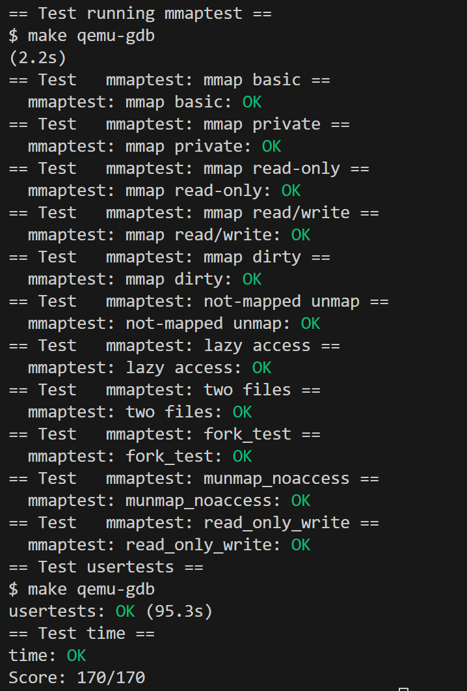

## 实验目的
在xv6操作系统中实现mmap和munmap系统调用，实现内存映射文件功能。通过本实验掌握虚拟内存管理、页错误处理、文件系统交互等操作系统核心机制。

## 实验步骤
### 1. 实验思路
mmap需要解决什么？
用户程序调用 mmap(addr, length, prot, flags, fd, offset) 后，应该能够：

1. 通过内存访问的方式读写文件内容
2. 不需要显式的read/write系统调用
3. 修改的内容能够写回到文件（如果是MAP_SHARED）

- 实现逻辑链条
1. 用户调用mmap时发生了什么？
```
// 用户程序
char *ptr = mmap(0, 4096, PROT_READ|PROT_WRITE, MAP_SHARED, fd, 0);
```
系统调用链路：
```
用户mmap() → usys.pl生成的汇编桩 → 内核syscall() → sys_mmap()
```
sys_mmap()的核心逻辑：
```
uint64 sys_mmap(void) {
  // 1. 获取参数
  uint64 addr, length, offset;
  int prot, flags, fd;
  
  // 2. 找到一个未使用的虚拟地址范围
  uint64 va = find_free_virtual_address(length);
  
  // 3. 分配VMA结构记录这个映射
  struct vma *v = allocate_vma();
  v->addr = va;
  v->length = length;
  v->prot = prot;
  v->flags = flags;
  v->file = get_file(fd);
  v->offset = offset;
  
  // 4. 关键：不分配物理内存！只记录映射关系
  // 返回虚拟地址给用户
  return va;
}
```
为什么不立即分配物理内存？避免不必要的内存占用.

2. 用户访问mmap区域时发生了什么？
```
// 用户程序尝试读取mmap的内存
char data = ptr[100];  // 这里会触发页错误！
```
页错误处理链路：
```
内存访问 → CPU发现页表中没有映射 → 页错误中断 → usertrap() → mmap_handler()
```
mmap_handler()的核心逻辑：
```
int mmap_handler(uint64 fault_va, uint64 scause) {
  // 1. 根据错误地址找到对应的VMA
  struct vma *v = find_vma_by_address(fault_va);
  if (!v) return -1;  // 不是mmap区域，非法访问
  
  // 2. 检查访问权限
  if (scause == 15 && !(v->prot & PROT_WRITE)) {
    return -1;  // 写入只读区域
  }
  
  // 3. 现在才分配物理内存
  char *mem = kalloc();  // 分配4KB物理页
  
  // 4. 从文件读取内容到物理内存
  uint64 file_offset = v->offset + (fault_va - v->addr);
  readi(v->file->ip, 0, (uint64)mem, file_offset, PGSIZE);
  
  // 5. 建立虚拟地址到物理地址的映射
  mappages(p->pagetable, fault_va, PGSIZE, (uint64)mem, 
           PTE_U | (v->prot & PROT_READ ? PTE_R : 0) | 
                   (v->prot & PROT_WRITE ? PTE_W : 0));
  
  return 0;  // 处理成功，用户程序继续执行
}
```
这样用户的内存访问就成功了！

3. 用户调用munmap时发生了什么？
```
// 用户程序
munmap(ptr, 4096);
```
sys_munmap()的核心逻辑：
```
uint64 sys_munmap(void) {
  uint64 addr;
  int length;
  
  // 1. 找到对应的VMA
  struct vma *v = find_vma_by_address(addr);
  
  // 2. 如果是MAP_SHARED，需要写回脏页
  if (v->flags & MAP_SHARED) {
    for (each dirty page in range) {
      // 将修改的内容写回文件
      writei(v->file->ip, 0, page_data, file_offset, PGSIZE);
    }
  }
  
  // 3. 释放物理内存和页表映射
  uvmunmap(p->pagetable, addr, length/PGSIZE, 1);
  
  // 4. 释放VMA结构
  v->used = 0;
  
  return 0;
}
```

## 2. 函数声明
修改：defs.h
```
int             mmap_handler(uint64, uint64);
void            uvmunmap_safe(pagetable_t, uint64, uint64, int);
struct vma*     find_vma(struct proc*, uint64);
// ...
```

## 3. 测试验证

### 编译和运行测试
```bash
# 清理并编译
make clean
make CPUS=1 LAB=mmap

# 启动xv6
make qemu CPUS=1 LAB=mmap

# 在xv6中运行mmap测试
mmaptest
```

### 输出
```
mmap_test starting
test mmap f
test mmap f: OK
test mmap private
test mmap private: OK  
test mmap read-only
test mmap read-only: OK
test mmap read/write
test mmap read/write: OK
test mmap dirty
test mmap dirty: OK
test not-mapped unmap
test not-mapped unmap: OK
test mmap two files
test mmap two files: OK
test fork
test fork: OK
test mmap_two_files_two_siblings
test mmap_two_files_two_siblings: OK
mmap_test: ALL OK
```

## 实验中遇到的问题和解决方法

### 1. 编译错误：头文件包含顺序问题
编译时出现未定义的结构体或类型错误
**解决：** 调整头文件包含顺序，确保相关定义在使用前已声明

### 2. 运行时panic：log_write outside of trans
**原因：** 在mmap页错误处理中读写文件时出现事务错误
**解决方法：** 在所有文件I/O操作前后使用begin_op()和end_op()包装

### 3. 运行时panic：mappages remap
**原因：** 尝试映射已存在的页面
**解决方法：** 在mmap_handler中添加页面存在性检查，避免重复映射

### 4. 为什么MAP_SHARED需要写回脏页？
```
// 进程A
int fd = open("data.txt", O_RDWR);
char *ptr_a = mmap(0, 4096, PROT_READ|PROT_WRITE, MAP_SHARED, fd, 0);
ptr_a[0] = 'A';  // 修改文件第一个字节

// 进程B
int fd2 = open("data.txt", O_RDONLY);  
char *ptr_b = mmap(0, 4096, PROT_READ, MAP_SHARED, fd2, 0);
printf("%c\n", ptr_b[0]);  // 用户期望看到'A'！

// 进程C
int fd3 = open("data.txt", O_RDONLY);
char buffer[1];
read(fd3, buffer, 1);  // 用户期望读到'A'！
```
如果MAP_SHARED不写回脏页，进程B和C就看不到进程A的修改。而MAP_PRIVATE为什么不需要写回？
MAP_PRIVATE使用Copy-on-Write机制，由于修改发生在复制的页面上，原文件从未被改变，所以不需要写回。


## 实验心得

本实验成功实现了xv6的mmap功能，主要技术要点包括：

1. 使用VMA结构记录内存映射信息，支持多个映射区域共存
2. mmap时不分配物理内存，访问时通过页错误处理按需分配
3. 正确处理文件读写，支持MAP_SHARED的写回机制
4. 实现安全的内存分配和释放，避免内存泄漏
5. 支持fork时VMA的正确继承

通过本实验，深入理解了虚拟内存管理、页错误处理、文件系统交互等操作系统核心机制。懒加载策略大大提高了内存使用效率，而VMA机制为复杂的内存映射需求提供了灵活的管理方案。

---